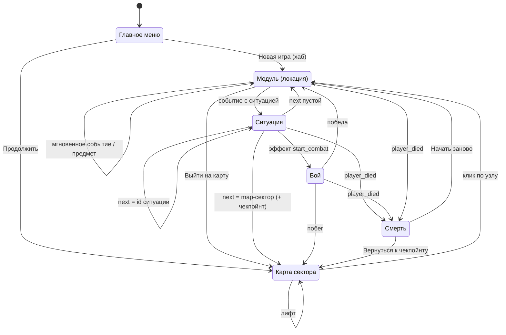

# Архитектура

Вся игровая логика живёт в автозагрузках (синглтонах) из `autoload/`. UI находится в `scenes/Game.gd` и `scenes/ui/`: он только читает состояние систем и вызывает их методы. Контент хранится в JSON в `data/` и загружается системами в `_ready()`. Модель контента описана в [CONTENT.md](CONTENT.md#модель-контента).

## Принципы

1. **`GameState` — единственный владелец переходов между экранами.** Остальные системы не переключают экраны: они эмитят сигналы или вызывают методы `GameState` (`enter_location`, `enter_situation`, `start_location_event`).
2. **Контент отдельно от кода.** Локации, события, ситуации, предметы, навыки, рецепты, враги, лор и карты описываются только в `data/`.
3. **Эффекты и условия применяются в одном месте.** Всё, что приходит из JSON в `effects`, `use_effect`, `requires` и `triggers`, проходит через `EffectResolver`.
4. **Глобальная шина только для общих событий.** В `EventBus` лежат лишь события, которые слушают несколько независимых систем. Локальные сигналы объявлены на самой системе.
5. **Единый контракт состояния.** Системы с состоянием забега реализуют `reset_for_new_run()`, `to_save_data()` и `load_save_data()`, а связывает их `SaveManager`.

## Автозагрузки

Порядок задан в `project.godot` и важен: `_ready()` вызываются именно в нём. `SaveManager` загружает meta-сейв в `_ready()`, поэтому `ArchiveSystem` и `EconomyManager` к этому моменту уже должны существовать. `GameState` подписывается на сигналы остальных систем, поэтому стоит последним.

| # | Автозагрузка | Файл | Ответственность |
|---|---|---|---|
| 1 | `McpBridgeGame` | `mcp_bridge_game.gd` | Инструмент разработки: TCP-мост в запущенной игре. См. [MCP.md](MCP.md) |
| 2 | `EventBus` | `EventBus.gd` | Глобальные сигналы: `player_died(cause)`, `returned_to_hub()`, `full_access_changed(value)` |
| 3 | `EffectResolver` | `EffectResolver.gd` | `apply_effect(s)` и `check_requirement(s)` для словарей из JSON |
| 4 | `ResourceSystem` | `ResourceSystem.gd` | HP (база + бонус), O2 (в секундах), патроны; тик O2; смерть при `hp <= 0` или `o2 <= 0` |
| 5 | `InventorySystem` | `InventorySystem.gd` | Сумка: слоты (база + бонус), стаки, использовать / выбросить / взаимодействия предметов |
| 6 | `CharacterSystem` | `CharacterSystem.gd` | Снаряжение в 5 слотах, навыки и очки навыков, итоговые характеристики |
| 7 | `CraftingSystem` | `CraftingSystem.gd` | Рецепты: проверка условий и материалов, создание предмета с откатом при нехватке места |
| 8 | `ArchiveSystem` | `ArchiveSystem.gd` | Открытые лор-фрагменты (meta-слой, переживает смерть) |
| 9 | `MapSystem` | `MapSystem.gd` | Загрузка сектора, состояния узлов, текущая палуба, лифты, клик по узлу |
| 10 | `SituationEngine` | `SituationEngine.gd` | Загрузка ситуаций, фильтр опций по `requires`, флаги забега |
| 11 | `LocationSystem` | `LocationSystem.gd` | Локации-модули: текущая локация, описание, доступность событий, визиты и выполненные события, сообщения |
| 12 | `CombatSystem` | `CombatSystem.gd` | Пошаговый бой: FSM `IDLE / PLAYER_TURN / RESOLVING / ENDED`, характеристики персонажа, эффекты `on_win`/`on_flee` |
| 13 | `EconomyManager` | `EconomyManager.gd` | Полный доступ, лимиты отката, rewarded-реклама через `EconomyProvider` |
| 14 | `SaveManager` | `SaveManager.gd` | `run.json`, `meta.json`, `checkpoint.json` |
| 15 | `GameState` | `GameState.gd` | FSM экранов, запуск событий, старт, продолжение, рестарт, откат |

Кроме автозагрузок есть два класса (не автозагрузки):
- `EconomyProvider` (`class_name`, `RefCounted`) — интерфейс платёжного и рекламного провайдера.
- `MockEconomyProvider` — заглушка, у которой покупка и реклама всегда успешны.

Реальные Android- и iOS-провайдеры должны наследоваться от `EconomyProvider` и подставляться в `EconomyManager._provider`.

## UI

| Файл | Что делает |
|---|---|
| `scenes/Game.gd` | HUD (HP, O2, патроны, кнопки «Карта», «Персонаж», «Архив», строка сумки) и тело экрана. Тело целиком перерисовывается по `GameState.screen_changed` |
| `scenes/ui/SectorMapView.gd` | Карта сектора: сетка, связи, узлы, кнопки палуб |
| `scenes/ui/CharacterPanel.gd` | Экран персонажа: вкладки «Предметы», «Снаряжение», «Навыки», «Крафт». Перерисовывается после каждого действия |
| `scenes/ui/CharacterDollView.gd` | Схематичный персонаж с кнопками пяти слотов и выносными линиями |
| `scenes/ui/UiKit.gd` | Общие хелперы: тексты, кнопки (`default`, `quiet`, `danger`, `tab_active`), карточки |

## Машина экранов

`GameState.Screen`: `MAIN_MENU`, `SECTOR_MAP`, `SITUATION`, `COMBAT`, `DEATH`, `LOCATION`. При каждом переходе эмитится `screen_changed`, и `Game.gd` полностью перерисовывает тело экрана.

Поверх текущего экрана `Game.gd` умеет показывать три оверлея, которые не меняют `GameState.current_screen`:
- **Архив** — список открытых лор-фрагментов.
- **Карта** — карта только для просмотра. Доступна из модуля или ситуации; в бою, на экране смерти и до загрузки сектора недоступна.
- **Персонаж** — `CharacterPanel`. Недоступен в главном меню, в бою и на экране смерти. При закрытии в модуле вызывается `GameState.refresh_location()`: предметы могли измениться, и автособытия перепроверяются.

Любая смена экрана закрывает оверлеи.

## Ключевые потоки

### Новая игра

`GameState.start_new_game()`:
1. `SaveManager.start_new_run()` сбрасывает все системы по `config.json` и удаляет `run.json` и `checkpoint.json`. `CharacterSystem` надевает `start_equipment` и выдаёт `start_skill_points`.
2. `MapSystem.load_sector(start_sector_id)` загружает стартовый сектор.
3. Если задан `opening_situation_id`, открывается эта ситуация. Иначе игрок входит в модуль хаба, и вступление проигрывается его автособытиями.

### Клик по узлу карты

`MapSystem.select_node(id)` проверяет по порядку:
- `locked` → отказ.
- Узел на другой палубе → отказ.
- Лифт (`map.kind = "elevator"`) → смена текущей палубы.
- Иначе: тик O2 включается, если узел не загерметизирован (`sealed: false`), и вызывается `GameState.enter_location(location_id, node_id)`.

Пройденные (`cleared`) и опасные (`dangerous`) узлы доступны для повторного входа.

Кнопки палуб справа от карты (`SectorMapView`) только переключают отображаемую палубу. Перемещают игрока лишь лифты.

### Модуль и события

1. **Вход.** `GameState.enter_location()` вызывает `LocationSystem.enter()`: визит +1, очищаются сообщения и список «сработало в этом визите».
2. **`_resume_location()`** в цикле берёт `LocationSystem.next_auto_event()` — первое автособытие, доступное по правилам:
   - разовое ещё не запускалось;
   - в этом визите не срабатывало;
   - `triggers` выполнены.
3. **`_run_event(ev)`:**
   - `LocationSystem.mark_started()` — счётчик запусков +1, отметка «сработало в визите»;
   - применяются `effects`;
   - `text` добавляется в сообщения;
   - если задан `situation`, открывается ситуация.

   Если событие увело игрока с экрана модуля (ситуация, бой, смерть), цикл прерывается. Иначе проверяется следующее автособытие. Предохранитель — 32 события за шаг.
4. **Экран модуля.** Когда автособытий не осталось, `_show_location()` показывает экран `LOCATION`. Если это модуль хаба, записывается чекпойнт.
5. **Ручное событие.** `GameState.start_location_event(id)` очищает сообщения и запускает событие через тот же `_run_event`, затем снова `_resume_location()`.
6. **Предмет или экран персонажа.** После использования предмета в модуле или закрытия экрана персонажа вызывается `GameState.refresh_location()`, и автособытия перепроверяются.
7. **Выход.** `GameState.leave_location()` → карта.

### Выбор опции в ситуации

`SituationEngine.select_option(id)`:
1. Применяет `effects` через `EffectResolver`.
2. Если игрок умер, на этом останавливается: экран смерти выставит `GameState` по `EventBus.player_died`.
3. Иначе эмитит `situation_ended(id, next)`, и `GameState` его обрабатывает:
   - Бой уже начат (`start_combat`) → ничего не делает.
   - `next = ""` → возврат в текущий модуль через `_resume_location()`. Если игрок не в модуле — на карту.
   - `next = "map:<sector>"` → выход из модуля, (пере)загрузка сектора, карта, `returned_to_hub` (чекпойнт).
   - `next = "<situation_id>"` → следующая ситуация.

### Персонаж: снаряжение, навыки, крафт

- **Сумка и снаряжение разделены.** `InventorySystem` хранит только сумку. Надетые предметы лежат в `CharacterSystem.equipment` (`слот → id`) и слотов сумки не занимают.
- **`CharacterSystem.equip(id)`:**
  - переносит предмет из сумки в его `equip_slot`;
  - прежний предмет слота возвращается в сумку;
  - заранее проверяется, хватит ли места с учётом меняющегося бонуса слотов. Иначе возвращается текст ошибки, а состояние не меняется.
- **`unequip(slot)`** — обратная операция с той же проверкой.
- **`_recalculate()`** складывает `stats` надетых предметов и `per_level × уровень` навыков, затем:
  - выставляет `InventorySystem.bonus_slots` (итог: `max_slots = base_slots + bonus_slots`);
  - выставляет бонус к макс. HP (`ResourceSystem.set_max_hp_bonus`: `max_hp = base_max_hp + бонус`, текущее HP обрезается сверху);
  - эмитит `changed`.
- **Навыки.** `learn(skill_id)` тратит `cost` очков, если уровень ниже `max_level`. Очки выдаёт эффект `skill_points_add`.
- **Условие `has_item`** считает и сумку, и надетое. Поэтому надетая труба по-прежнему открывает шлюз.
- **Эффект `item_remove`** сначала убирает из сумки, затем надетый экземпляр.
- **`CraftingSystem.craft(id)`:**
  1. проверяет `requires` и материалы (только в сумке);
  2. списывает материалы и добавляет результат;
  3. если результат не влез — убирает добавленное и возвращает материалы.

### Кислород

`ResourceSystem` тратит O2 каждый кадр, только пока `o2_ticking = true`. Тик включает `MapSystem.select_node` для незагерметизированных узлов; он продолжается внутри модуля и его ситуаций. `GameState._set_screen(SECTOR_MAP)` и лифты тик выключают. Сейчас все модули загерметизированы, поэтому O2 меняется только эффектами `o2_delta`.

### Бой

Характеристики — из `CharacterSystem.get_stat()`.

| Действие | Логика |
|---|---|
| `attack` | С патронами: шанс 75% + точность (не выше 95%), урон 15 + урон в дальнем бою, −1 патрон. Без патронов: шанс 50% + точность, урон 8 + урон в ближнем бою (оружие в слоте «Руки», навык «Ближний бой»), промах стоит игроку 10 HP. Затем ход врага |
| `defend` | Ход врага с множителем урона 0.5 |
| `use_item` | `InventorySystem.use_item(id)` (расходник удаляется), затем ход врага |
| `flee` | Риск неудачи = `flee_risk` врага − шанс побега (не ниже 5%); при неудаче — ход врага |
| `special` | Спецдействие врага из `special_actions`: один раз за бой, при выполнении `requires`. Тип `skip_enemy_turn_and_guarantee_hit` наносит `value` урона без ответного хода |

Ход врага: попадание с шансом `attack.hit_chance`, урон = `max(1, randi_range(min, max) × множитель − броня)`. При победе в сумку выдаётся `loot`.

Итог боя `combat_ended(result)` обрабатывает `GameState`:
- **`won`:**
  - применяются `on_win` из эффекта `start_combat`;
  - `clear_node` становится `cleared`;
  - игрок **возвращается в модуль** (с проверкой автособытий).
- **`fled`:**
  - применяются `on_flee`;
  - `clear_node` становится `dangerous`;
  - игрок покидает модуль и попадает на карту.
- **`died`:** переход делает `player_died`.

### Смерть, рестарт, откат

1. При смерти `SaveManager` только сохраняет meta, а `GameState` показывает экран смерти.
2. Решение принимает игрок:
   - **Начать заново** → `GameState.choose_restart()`: очистка забега, сохранение meta, новая игра.
   - **Вернуться к чекпойнту** → `Game._death_rollback()` один раз списывает откат в `EconomyManager`, затем `GameState.choose_rollback()` восстанавливает `checkpoint.json` и открывает карту.

Кнопка отката показывается, только если есть чекпойнт и `EconomyManager.can_use_rollback_today()` возвращает `true`.

Правила экономики (`EconomyManager`):
- Без полного доступа: 1 откат через рекламу в сутки (`DAILY_AD_LIMIT`, по системной дате).
- С полным доступом: 1 бесплатный откат за забег, дальше рекламный лимит.
- Кнопки покупки полного доступа в UI пока нет.

## Сохранения

Файлы лежат в `user://` (на Windows это `%APPDATA%\Godot\app_userdata\CosmoTextGame\`). Формат — JSON.

| Файл | Содержимое | Когда пишется |
|---|---|---|
| `run.json` | см. список ниже | При записи чекпойнта (`EventBus.returned_to_hub`) |
| `checkpoint.json` | Копия `run.json` | Там же: при показе экрана модуля хаба и при `next: "map:..."` |
| `meta.json` | `archive` (id лор-фрагментов), `economy` (полный доступ, счётчик рекламных откатов) | При смерти, рестарте и откате |

Блоки `run.json`:
- `resources` — HP, `max_hp`, `base_max_hp`, O2, патроны;
- `inventory` — `base_slots` и слоты сумки;
- `character` — `equipment`, уровни `skills`, `skill_points`;
- `situation` — флаги и текущая ситуация;
- `locations` — визиты `visits` и счётчики запусков событий `done`;
- `map` — сектор, палуба, состояния узлов;
- `economy_run`.

`SaveManager.load_run()` загружает `character` после `resources` и `inventory`: пересчёт характеристик выставляет бонусы слотов и HP. При новой игре `run.json` и `checkpoint.json` удаляются. Кнопка «Продолжить» в меню видна, если существует `run.json`. Она восстанавливает состояние последнего чекпойнта и открывает карту.

Сейвы старых версий загружаются. Отсутствующие блоки (`locations`, `character`) начинаются с нуля.

## Решения и отклонения от tech-spec-v1

1. **`EffectResolver`** — автозагрузки нет в исходном ТЗ. Ситуации, события, предметы, рецепты и спецдействия используют одинаковую форму эффектов и условий, и без общей точки пришлось бы дублировать `match` по типам в нескольких системах.
2. **Подход к бою и сам бой разделены.** В GDD бой 1.3 был одной ситуацией с опциями A/Б/В. Здесь `sit_1_3_drone.json` содержит только решение «войти в бой / отступить», а бой идёт через `CombatSystem`. Так боевая система переиспользуется для любого врага.
3. **Решение на экране смерти принимает игрок.** `SaveManager` не выбирает между рестартом и откатом, он только исполняет `confirm_restart()` или `confirm_rollback()`.
4. **`clear_node`, `on_win`, `on_flee` в `start_combat`.** Итог боя меняет состояние узла и флаги, а не возвращает игрока в ту же ситуацию. Раньше это позволяло «убить» дрона повторно.
5. **Откат списывается один раз.** `confirm_rollback()` не трогает экономику; списание делает вызывающий код в UI по выбранному пути.
6. **Карта выключает тик O2.** Это защитное правило в `GameState._set_screen()`.
7. **Палубы и лифты.** `MapSystem` хранит `current_floor_id`, лифты — это обычные узлы с `map.kind = "elevator"`.
8. **Модули-локации вместо одноразовых ситуаций на узлах.** Узел ссылается на локацию (`location_id`) с описанием и событиями. В модуль можно вернуться. События бывают авто и ручными, разовыми и повторяемыми, у них есть триггеры. Разовое событие засчитывается при запуске: повторяющиеся угрозы описываются явно через `repeatable` и флаги.
9. **Персонаж — отдельные системы поверх сумки.** `InventorySystem` остался сумкой. Снаряжение, навыки и характеристики вынесены в `CharacterSystem`, крафт — в `CraftingSystem`. Характеристики — единый словарь (`stats` предметов, `per_level` навыков), который читают бой, сумка и HP. Новая характеристика добавляется в одном месте: константы `CharacterSystem.STAT_TITLES`, `STATS` в валидаторе и место применения. Слот «Руки» — это оружие или инструмент в руках.
