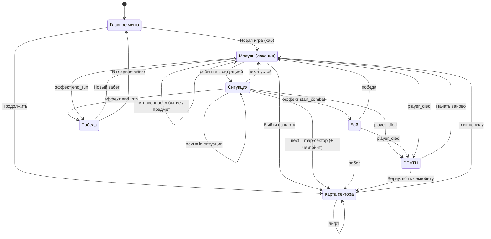

# Архитектура

Вся игровая логика живёт в автозагрузках (синглтонах) из `autoload/`. UI находится в `scenes/Game.gd` и `scenes/ui/`: он только читает состояние систем и вызывает их методы. Контент хранится в JSON в `data/` и загружается системами в `_ready()`. Модель контента описана в [CONTENT.md](CONTENT.md#модель-контента).

## Принципы

1. **`GameState` — единственный владелец переходов между экранами.** Остальные системы не переключают экраны: они эмитят сигналы или вызывают методы `GameState` (`enter_location`, `enter_situation`, `start_location_event`).
2. **Контент отдельно от кода.** Локации, события, ситуации, предметы, навыки, рецепты, враги, лор и карты описываются только в `data/`.
3. **Эффекты и условия применяются в одном месте.** Всё, что приходит из JSON в `effects`, `use_effect`, `requires` и `triggers`, проходит через `EffectResolver`.
4. **Глобальная шина только для общих событий.** В `EventBus` лежат лишь события, которые слушают несколько независимых систем. Локальные сигналы объявлены на самой системе.
5. **Единый контракт состояния.** Системы с состоянием забега реализуют `reset_for_new_run()`, `to_save_data()` и `load_save_data()`, а связывает их `SaveManager`.

## Автозагрузки

Порядок задан в `project.godot` и важен: `_ready()` вызываются именно в нём. `SaveManager` загружает meta-сейв в `_ready()`, поэтому `ArchiveSystem` и `EconomyManager` к этому моменту уже должны существовать. `GameState` подписывается на сигналы остальных систем, поэтому стоит последним.

| # | Автозагрузка | Файл | Ответственность |
|---|---|---|---|
| 1 | `McpBridgeGame` | `mcp_bridge_game.gd` | Инструмент разработки: TCP-мост в запущенной игре. См. [MCP.md](MCP.md) |
| 2 | `EventBus` | `EventBus.gd` | Глобальные сигналы: `player_died(cause)`, `returned_to_hub()` |
| 3 | `SettingsSystem` | `SettingsSystem.gd` | Настройки интерфейса: размер шрифта и плавные переходы (`user://settings.json`) |
| 4 | `NarrativeSystem` | `NarrativeSystem.gd` | Лента повествования забега: сцены, тексты, выборы, последствия, сообщения |
| 5 | `EffectResolver` | `EffectResolver.gd` | `apply_effect(s)` и `check_requirement(s)` для словарей из JSON |
| 6 | `ResourceSystem` | `ResourceSystem.gd` | HP (база + бонус), O2 (запас в единицах) и его цены за действия, патроны; смерть при `hp <= 0` или `o2 <= 0` |
| 7 | `InventorySystem` | `InventorySystem.gd` | Сумка: слоты (база + бонус), стаки, использовать / выбросить / взаимодействия предметов |
| 8 | `CharacterSystem` | `CharacterSystem.gd` | Снаряжение в 5 слотах, навыки и очки навыков, итоговые характеристики |
| 9 | `CraftingSystem` | `CraftingSystem.gd` | Рецепты: проверка условий и материалов, создание предмета с откатом при нехватке места |
| 10 | `ArchiveSystem` | `ArchiveSystem.gd` | Открытые лор-фрагменты (meta-слой, переживает смерть) |
| 11 | `ChronicleSystem` | `ChronicleSystem.gd` | Хроника забегов (meta): победы, смерти, открытые финалы; тексты финалов из `data/endings.json` |
| 12 | `NotificationSystem` | `NotificationSystem.gd` | Метки «новое» на кнопках «Персонаж» и «Журнал» |
| 13 | `MapSystem` | `MapSystem.gd` | Загрузка сектора, состояния узлов, текущая палуба, лифты, клик по узлу |
| 14 | `SituationEngine` | `SituationEngine.gd` | Загрузка ситуаций, фильтр опций по `requires`, флаги забега |
| 15 | `LocationSystem` | `LocationSystem.gd` | Локации-модули: текущая локация, описание, доступность событий, визиты и выполненные события, сообщения |
| 16 | `CombatSystem` | `CombatSystem.gd` | Бой в духе Neo Scavenger: манёвры, дистанция, ИИ противника, эффекты `on_win`/`on_flee` |
| 17 | `JournalSystem` | `JournalSystem.gd` | Общий журнал забега: хронология переходов, событий, выборов, боёв, находок и финала |
| 18 | `EconomyManager` | `EconomyManager.gd` | Полный доступ, лимиты отката, rewarded-реклама через `EconomyProvider` |
| 19 | `SaveManager` | `SaveManager.gd` | `run.json`, `meta.json`, `checkpoint.json` |
| 20 | `GameState` | `GameState.gd` | FSM экранов, запуск событий, старт, продолжение, рестарт, откат, завершение забега |

Кроме автозагрузок есть два класса (не автозагрузки):
- `EconomyProvider` (`class_name`, `RefCounted`) — интерфейс платёжного и рекламного провайдера.
- `MockEconomyProvider` — заглушка, у которой покупка и реклама всегда успешны.

Реальные Android- и iOS-провайдеры должны наследоваться от `EconomyProvider` и подставляться в `EconomyManager._provider`.

## UI

| Файл | Что делает |
|---|---|
| `scenes/Game.gd` | HUD (HP, O2, патроны, сумка и кнопки «Карта», «Персонаж», «Журнал», «Настройки») и тело экрана: лента повествования, действия, оверлеи, анимации переходов |
| `scenes/ui/SectorMapView.gd` | Карта сектора: сетка, связи, узлы, кнопки палуб. Масштаб считается по видимой части сетки, поэтому карта занимает всю ширину |
| `scenes/ui/CharacterPanel.gd` | Экран персонажа: вкладки «Предметы» (сетка сумки с иконками), «Снаряжение», «Навыки», «Крафт». Перерисовывается после каждого действия |
| `scenes/ui/CharacterDollView.gd` | Схематичный персонаж с кнопками пяти слотов и выносными линиями |
| `scenes/ui/UiKit.gd` | Общие хелперы: масштаб шрифта `fs()`, тексты, кнопки (`default`, `quiet`, `danger`, `exit`, `tab_active`), карточки, пиксельный арт и портреты |
| `scenes/ui/CombatView.gd` | Экран боя: портреты и карточки сторон, линейка дистанции, сетка манёвров, журнал схватки |

### Лента повествования

Экраны модуля и ситуации — это **одна лента** (`NarrativeSystem`), а не два набора полей: каждая новая реплика дописывается снизу, старые остаются на месте, экран доматывается к концу и подсвечивает новые записи. Записи бывают `scene` (заголовок модуля или сцены), `text` (описание, текст события или ситуации), `choice` (реплика игрока), `result` (последствие выбора), `notice` (взял предмет, заперто, не поместилось) и `system`. Лента живёт весь забег (потолок — `MAX_ENTRIES`), лежит в `run.json` и обнуляется только новой игрой.

Ситуация не обрывается на выборе: `SituationEngine.select_option` кладёт в ленту реплику, применяет эффекты, кладёт текст `result` из контента и переходит в режим ожидания (`awaiting_continue`). Экран показывает кнопку «Продолжить», и только `confirm_continue()` эмитит `situation_ended`. Исключения — смерть и начало боя: там экран переключается сразу.

### Настройки интерфейса

`SettingsSystem` хранит размер шрифта (`small` / `medium` / `large` → множители 1.0 / 1.2 / 1.45) и флаг плавных переходов в `user://settings.json`. Все размеры шрифта в UI задаются через `UiKit.fs()`, поэтому настройка применяется сразу по сигналу `changed`. Анимации — короткий fade тела экрана при смене экрана или оверлея, fade новых записей ленты и плавная доскролловка вниз; при выключенной настройке всё происходит мгновенно.

Выхода «на карту» отдельной кнопкой больше нет: кнопка «Карта» в HUD на экране модуля выводит игрока наружу (`GameState.leave_location`), в ситуации открывает карту только для просмотра, на самой карте ничего не делает.

## Машина экранов

`GameState.Screen`: `MAIN_MENU`, `SECTOR_MAP`, `SITUATION`, `COMBAT`, `DEATH`, `LOCATION`, `VICTORY`. При каждом переходе эмитится `screen_changed`, и `Game.gd` полностью перерисовывает тело экрана.

```mermaid
stateDiagram-v2
    state "Главное меню" as MENU
    state "Карта сектора" as MAP
    state "Модуль (локация)" as LOC
    state "Ситуация" as SIT
    state "Бой" as COMBAT
    state "Победа" as WIN

    [*] --> MENU
    MENU --> LOC: Новая игра (хаб)
    MENU --> MAP: Продолжить
    MAP --> LOC: клик по узлу
    MAP --> MAP: лифт
    LOC --> SIT: событие с ситуацией
    LOC --> LOC: мгновенное событие / предмет
    LOC --> MAP: Выйти на карту
    SIT --> SIT: next = id ситуации
    SIT --> LOC: next пустой
    SIT --> MAP: next = map-сектор (+ чекпойнт)
    SIT --> COMBAT: эффект start_combat
    COMBAT --> LOC: победа
    COMBAT --> MAP: побег
    SIT --> DEATH: player_died
    COMBAT --> DEATH: player_died
    LOC --> DEATH: player_died
    DEATH --> LOC: Начать заново
    DEATH --> MAP: Вернуться к чекпойнту
    SIT --> WIN: эффект end_run
    LOC --> WIN: эффект end_run
    WIN --> LOC: Новый забег
    WIN --> MENU: В главное меню
```

Поверх текущего экрана `Game.gd` умеет показывать три оверлея, которые не меняют `GameState.current_screen`:
- **Журнал** — две вкладки: «Хроника» (записи `JournalSystem` — что уже произошло в забеге, свежие сверху, у каждой записи остаток O2) и «Архив» (открытые лор-фрагменты `ArchiveSystem`). Недоступен в главном меню, в бою, на экране смерти и победы.
- **Карта** — карта только для просмотра. Доступна из модуля или ситуации; в бою, на экране смерти и до загрузки сектора недоступна.
- **Персонаж** — `CharacterPanel`. Недоступен в главном меню, в бою, на экране смерти и на экране победы. При закрытии в модуле вызывается `GameState.refresh_location()`: предметы могли измениться, и автособытия перепроверяются.

Любая смена экрана закрывает оверлеи.

## Ключевые потоки

### Новая игра

`GameState.start_new_game()`:
1. `SaveManager.start_new_run()` сбрасывает все системы по `config.json` и удаляет `run.json` и `checkpoint.json`. `CharacterSystem` надевает `start_equipment` и выдаёт `start_skill_points`.
2. `MapSystem.load_sector(start_sector_id)` загружает стартовый сектор.
3. Если задан `opening_situation_id`, открывается эта ситуация. Иначе игрок входит в модуль хаба, и вступление проигрывается его автособытиями.

### Клик по узлу карты

`MapSystem.select_node(id)` проверяет по порядку:
- `locked` → отказ.
- Узел на другой палубе → отказ.
- Лифт (`map.kind = "elevator"`) → списывается цена `elevator` и меняется текущая палуба.
- Иначе: списывается цена `move` по узлу назначения (в узле с `sealed: false` — с множителем) и вызывается `GameState.enter_location(location_id, node_id)`. Если кислород кончился в пути, вход не происходит: экран смерти выставит `EventBus.player_died`.

Пройденные (`cleared`) и опасные (`dangerous`) узлы доступны для повторного входа.

Кнопки палуб справа от карты (`SectorMapView`) только переключают отображаемую палубу. Перемещают игрока лишь лифты.

### Модуль и события

1. **Вход.** `GameState.enter_location()` вызывает `LocationSystem.enter()`: визит +1, сбрасывается список «сработало в этом визите», а в ленту уходит новая сцена — заголовок, иллюстрация и описание модуля.
2. **`_resume_location()`** в цикле берёт `LocationSystem.next_auto_event()` — первое автособытие, доступное по правилам:
   - разовое ещё не запускалось;
   - в этом визите не срабатывало;
   - `triggers` выполнены.
3. **`_run_event(ev)`:**
   - `LocationSystem.mark_started()` — счётчик запусков +1, отметка «сработало в визите»;
   - `text` и `image` события уходят в ленту;
   - применяются `effects` (их сообщения ложатся в ленту следом);
   - если задан `situation`, открывается ситуация.

   Если событие увело игрока с экрана модуля (ситуация, бой, смерть), цикл прерывается. Иначе проверяется следующее автособытие. Предохранитель — 32 события за шаг.
4. **Экран модуля.** Когда автособытий не осталось, `_show_location()` показывает экран `LOCATION`. Если это модуль хаба, записывается чекпойнт.
5. **Ручное событие.** `GameState.start_location_event(id)` кладёт в ленту реплику игрока (label), проверяет замок, списывает кислород и запускает событие через тот же `_run_event`, затем снова `_resume_location()`.
6. **Предмет или экран персонажа.** После использования предмета в модуле или закрытия экрана персонажа вызывается `GameState.refresh_location()`, и автособытия перепроверяются.
7. **Выход.** Кнопка «Карта» в HUD → `GameState.leave_location()` → карта.

### Выбор опции в ситуации

`SituationEngine.select_option(id)`:
1. Списывает цену `choice` по кислороду и кладёт в ленту реплику игрока (`label`).
2. Применяет `effects` через `EffectResolver`.
3. Кладёт в ленту `result` варианта.
4. Если игрок умер — останавливается: экран смерти выставит `GameState` по `EventBus.player_died`. Если начался бой — тоже останавливается, экран уже переключён.
5. Иначе переходит в `awaiting_continue`: UI показывает кнопку «Продолжить».

`SituationEngine.confirm_continue()` (кнопка «Продолжить» или `GameState.finish_situation`) эмитит `situation_ended(id, next)`, и `GameState` его обрабатывает:
- Бой уже начат (`start_combat`) → ничего не делает.
- `next = ""` → возврат в текущий модуль через `_resume_location()`. Если игрок не в модуле — на карту.
- `next = "map:<sector>"` → выход из модуля, (пере)загрузка сектора, карта, `returned_to_hub` (чекпойнт).
- `next = "<situation_id>"` → следующая ситуация.

### Персонаж: снаряжение, навыки, крафт

- **Сумка и снаряжение разделены.** `InventorySystem` хранит только сумку. Надетые предметы лежат в `CharacterSystem.equipment` (`слот → id`) и слотов сумки не занимают.
- **`CharacterSystem.equip(id)`:**
  - переносит предмет из сумки в его `equip_slot`;
  - прежний предмет слота возвращается в сумку;
  - заранее проверяется, хватит ли места с учётом меняющегося бонуса слотов. Иначе возвращается текст ошибки, а состояние не меняется.
- **`unequip(slot)`** — обратная операция с той же проверкой.
- **`_recalculate()`** складывает `stats` надетых предметов и `per_level × уровень` навыков, затем:
  - выставляет `InventorySystem.bonus_slots` (итог: `max_slots = base_slots + bonus_slots`);
  - выставляет бонус к макс. HP (`ResourceSystem.set_max_hp_bonus`: `max_hp = base_max_hp + бонус`, текущее HP обрезается сверху);
  - эмитит `changed`.
- **Навыки.** `learn(skill_id)` тратит `cost` очков, если уровень ниже `max_level`. Очки выдаёт эффект `skill_points_add`.
- **Условие `has_item`** считает и сумку, и надетое. Поэтому надетая труба по-прежнему открывает шлюз.
- **Эффект `item_remove`** сначала убирает из сумки, затем надетый экземпляр.
- **`CraftingSystem.craft(id)`:**
  1. проверяет `requires` и материалы (только в сумке);
  2. списывает материалы и добавляет результат;
  3. если результат не влез — убирает добавленное и возвращает материалы.

### Кислород

O2 — не таймер, а запас в единицах: реальное время его не трогает, `ResourceSystem` не имеет `_process`. Кислород тратится на действия игрока, цены лежат в `data/config.json` → `o2_costs` и читаются `ResourceSystem` при старте (контент, в сейв не попадают).

| Цена | Действие | Кто списывает |
|---|---|---|
| `move` | Переход в модуль по клику на узел карты | `MapSystem.select_node` (по узлу назначения) |
| `elevator` | Поездка на лифте | `MapSystem._move_by_elevator` |
| `action` | Запуск ручного события в модуле | `GameState.start_location_event` |
| `choice` | Выбор варианта в ситуации | `SituationEngine.select_option` |
| `combat_turn` | Ход в бою (атака, защита, побег, предмет, спецдействие) | `CombatSystem.player_action` |

В узле без давления (`sealed: false`) цена умножается на `config.o2_unsealed_multiplier`. Среду определяет узел: для перехода — узел назначения, для остальных действий — узел текущего модуля.

Всё списывает `ResourceSystem.spend_o2(kind, node_id = "")`. Он возвращает `false`, если баллон опустел: вызывающий код обязан прервать действие — игрок уже мёртв, и экран смерти выставит `EventBus.player_died`. Поэтому переход без кислорода не заводит игрока в модуль, а ход в бою заканчивает бой результатом `died`.

Кислорода **не стоят** использование предметов, подбор вещей с пола, крафт и экран персонажа: это противовес расходу, а не действие на выживание. Пополняют запас только эффекты `o2_delta` из контента (баллоны, медицинская линия).

### Ключи и замки

Предмет-ключ описан полем `unlocks: ["<id замка>", ...]` и категорией `key`; такие предметы не занимают слот сумки (`slot_cost: 0`) и не выбрасываются. Замок в контенте — словарь `{ "key": "<id замка>", "consume": bool, "text": "..." }`, он ставится:
- на узел карты (`sectors/*.json`, узел в состоянии `locked`) — «закрытый отсек»;
- на ручное событие локации (`events[].lock`) — «запертый ящик».

Проверку и открытие делает `EffectResolver`: `can_open_lock`, `open_lock` (тратит ключ при `consume: true`), `lock_hint` (текст для UI). Поиск ключа в сумке и в снаряжении — `InventorySystem.find_key`.

- **Узел.** `MapSystem.select_node` на запертом узле с замком: есть ключ → узел открывается (`available`), запись уходит в журнал забега, игрок входит внутрь; ключа нет → сигнал `node_blocked`, и `Game.gd` пишет причину над картой. У неразведанного узла название ключа не раскрывается.
- **Событие.** Запертое событие видно в меню модуля неактивной кнопкой с подсказкой, какой ключ нужен. `GameState.start_location_event` проверяет замок до списания кислорода, затем открывает его.
- **Условие `has_key`** (`{ "type": "has_key", "lock": "..." }`) позволяет описывать в контенте любые проверки «есть ли ключ».

### Модуль-база

Локация с полем `base: true` (сейчас это `hub`) — точка возврата забега:
- при показе её экрана пишется чекпойнт (наравне с узлом-хабом);
- в разделе «База» на экране модуля есть «Сохранить забег» (`SaveManager.write_checkpoint`), «Верстак: открыть крафт» (открывает экран персонажа на вкладке «Крафт») и список «Разложить по складу» — выгрузка предметов из сумки;
- склад — это обычный `LocationSystem` stash модуля: он уже сохраняется в `run.json`, поэтому отдельной системы не нужно. На экране базы раздел называется «Склад», в обычных модулях — «Здесь лежит».

### Пиксельный арт

Картинки лежат в `assets/art`: сцены 160×96 (`scenes/<image>.png`) и иконки предметов 16×16 (`items/<item_id>.png`). Генератор — `tools/make_pixel_art.py` (чистый Python, без зависимостей), он же документирует, как нарисован каждый кадр.

Контент ссылается на сцены полем `image` у ситуации, локации и события (см. [CONTENT.md](CONTENT.md)). Показывает их `Game.gd`: на экране ситуации — её картинка, на экране модуля — картинка сработавшего события (`LocationSystem.event_image`), а если события не было — картинка самой локации. Иконки предметов подтягиваются по id автоматически: они видны в сетке сумки, в карточках предметов и в списке расходников боя.

Загрузка и масштабирование — в `UiKit`: `scene_art` (ширина тела экрана, высота по пропорции) и `item_icon`, оба с фильтром `TEXTURE_FILTER_NEAREST`, иначе пиксели мылятся.

### Бой

Бой сделан по мотивам Neo Scavenger: ход — это выбор **манёвра**, ходы игрока и противника разыгрываются одновременно. Характеристики — из `CharacterSystem.get_stat()`.

Порядок хода (`CombatSystem.player_action`):
1. списывается цена `combat_turn` по кислороду (пустой баллон = смерть и конец боя);
2. противник выбирает манёвр по своему типу ИИ;
3. применяются перемещения обеих сторон — дистанция меняется на **сумму** сдвигов, поэтому отход под наступление врага её не меняет;
4. по новой дистанции разыгрывается манёвр игрока, затем манёвр противника.

Дистанция `range_steps` — 0…`MAX_RANGE` (5). Начальная берётся из `start_range` врага.

| Манёвр игрока | Условие | Эффект |
|---|---|---|
| `shoot` | есть патроны | −1 патрон, шанс 75% + точность + прицел − 8% за каждый шаг дальше второго (−15% в упор), урон 15 + дальний бой |
| `strike` | дистанция ≤ 1 | шанс 60% + точность + прицел, урон 8 + ближний бой; промах стоит 6 HP |
| `approach` / `retreat` | дистанция > 0 / < 5 | сдвиг на шаг |
| `aim` | всегда | +25% к попаданию следующей атаки; сбивается попаданием врага |
| `defend` | всегда | входящий урон ×0.5 и −20% к попаданию врага в этот ход |
| `flee` | всегда | с дистанции ≥ 4 (или когда враг ушёл в защиту) — гарантированный отрыв; иначе бросок против `flee_risk` − шанс побега − 8% за шаг, при неудаче враг бьёт с множителем 1.5 |
| `use_item` | расходник в сумке | использование предмета вместо атаки |
| `special` | `special_actions` врага, один раз за бой | тип `distract`: враг теряет цель на `value` ходов (урона нет), а первая атака игрока по нему проходит без броска |

ИИ противника задаётся полем `ai` в `enemies.json`:
- `brawler` — идёт на сближение и бьёт; на четверти HP иногда уходит в защиту;
- `shooter` — держит `preferred_range`, отходит, если подошли слишком близко;
- `turret` — не двигается: стреляет, когда цель в пределах `attack.range`, иначе ждёт.

Ход врага: попадание с шансом `attack.hit_chance` (−20%, если игрок защищается), урон = `max(1, randi_range(min, max) × множитель − броня)`. При победе в сумку выдаётся `loot`.

UI боя — `scenes/ui/CombatView.gd`: карточки сторон (HP, оружие, последний манёвр, состояния), линейка дистанции, сетка манёвров с причинами недоступности и цветной журнал схватки.

Итог боя `combat_ended(result)` обрабатывает `GameState`:
- **`won`:**
  - применяются `on_win` из эффекта `start_combat`;
  - `clear_node` становится `cleared`;
  - игрок **возвращается в модуль** (с проверкой автособытий).
- **`fled`:**
  - применяются `on_flee`;
  - `clear_node` становится `dangerous`;
  - игрок покидает модуль и попадает на карту.
- **`died`:** переход делает `player_died`.

### Победа, смерть, рестарт, откат

Победу даёт эффект `end_run` (только из контента): `GameState.finish_run(ending_id)` проверяет id по `data/endings.json`, выводит игрока из модуля, пишет результат в `ChronicleSystem`, вызывает `SaveManager.finish_run()` (meta + удаление `run.json` и `checkpoint.json`) и показывает экран `VICTORY`. Продолжить завершённый забег нельзя — только новый забег или выход в меню.

`ChronicleSystem` — meta-слой рядом с архивом: считает завершённые забеги, победы, смерти и запоминает, какие финалы уже открыты (`endings_seen`). Смерти он ловит сам через `EventBus.player_died`, поэтому записывается раньше, чем `SaveManager` сохраняет meta.

1. При смерти `SaveManager` только сохраняет meta, а `GameState` показывает экран смерти.
2. Решение принимает игрок:
   - **Начать заново** → `GameState.choose_restart()`: очистка забега, сохранение meta, новая игра.
   - **Вернуться к чекпойнту** → `Game._death_rollback()` один раз списывает откат в `EconomyManager`, затем `GameState.choose_rollback()` восстанавливает `checkpoint.json` и открывает карту.

Кнопка отката показывается, только если есть чекпойнт и `EconomyManager.can_use_rollback_today()` возвращает `true`.

Правила экономики (`EconomyManager`):
- Без полного доступа: 1 откат через рекламу в сутки (`DAILY_AD_LIMIT`, по системной дате).
- С полным доступом: 1 бесплатный откат за забег, дальше рекламный лимит.
- Кнопки покупки полного доступа в UI пока нет. Откат за рекламу выполняется только после успешного `ad_completed(true)`; при отказе рекламы экран смерти показывает сообщение и откат не тратится.

## Сохранения

Файлы лежат в `user://` (на Windows это `%APPDATA%\Godot\app_userdata\CosmoTextGame\`). Формат — JSON.

Запись **атомарная**: `SaveManager._write_text()` пишет во временный `<файл>.tmp` и переименовывает его поверх целевого. Краш или разряд батареи в момент записи портит только `.tmp`, а предыдущий сейв остаётся целым.

| Файл | Содержимое | Когда пишется |
|---|---|---|
| `run.json` | см. список ниже | Автосохранение в безопасной точке: при показе карты и экрана модуля (`GameState._set_screen` → `SaveManager.autosave()`), а также при сворачивании и закрытии приложения |
| `checkpoint.json` | Копия `run.json` | При записи чекпойнта (`EventBus.returned_to_hub`): экран модуля хаба и `next: "map:..."` |
| `meta.json` | `archive` (id лор-фрагментов), `chronicle` (забеги, победы, смерти, открытые финалы), `economy` (полный доступ, счётчик рекламных откатов) | Сразу при изменении (новый лор-фрагмент, покупка, финал), при смерти, рестарте, откате и при сворачивании приложения |

**Безопасная точка** — экраны `SECTOR_MAP` и `LOCATION`. Бой и ситуация не сохраняются намеренно: если игру закрыли посреди боя, забег продолжится со входа в модуль и бой придётся пройти заново, а не пропустить.

Сворачивание и закрытие ловит `SaveManager._notification()` (`NOTIFICATION_WM_CLOSE_REQUEST`, `NOTIFICATION_WM_GO_BACK_REQUEST`, `NOTIFICATION_APPLICATION_PAUSED`, `NOTIFICATION_APPLICATION_FOCUS_OUT`) — на мобильных систему может убить процесс без выхода из игры.

Блоки `run.json`:
- `version` — версия формата (`SaveManager.SAVE_VERSION`);
- `resources` — HP, `max_hp`, `base_max_hp`, `o2` (запас кислорода), патроны;
- `inventory` — `base_slots` и слоты сумки;
- `character` — `equipment`, уровни `skills`, `skill_points`;
- `situation` — флаги и текущая ситуация;
- `locations` — визиты `visits`, счётчики запусков событий `done` и вещи на полу;
- `map` — сектор, палуба, состояния узлов;
- `journal` — записи общего журнала забега (`kind`, `text`, `o2`, `count`);
- `narrative` — лента повествования (`kind`, `text`, `image`): после «Продолжить» игрок видит ту же сцену, что и до выхода из игры;
- `game_state`, `notifications`, `economy_run`.

`SaveManager.load_run()` загружает `character` после `resources` и `inventory`: пересчёт характеристик выставляет бонусы слотов и HP. При новой игре `run.json` и `checkpoint.json` удаляются. Кнопка «Продолжить» в меню видна, если существует `run.json`; она восстанавливает последнее автосохранение и открывает карту.

Версии: сейв без поля `version` считается версией 0 и читается как раньше — отсутствующие блоки начинаются с нуля. Версия 1 — кислород по таймеру (ключ `resources.o2_seconds`, читается как `o2`), версия 2 — кислород за действия и журнал забега. Сейв с версией **новее** `SAVE_VERSION` не загружается (ошибка в лог), как и повреждённый файл; в обоих случаях «Продолжить» начинает новый забег.

## Решения и отклонения от tech-spec-v1

1. **`EffectResolver`** — автозагрузки нет в исходном ТЗ. Ситуации, события, предметы, рецепты и спецдействия используют одинаковую форму эффектов и условий, и без общей точки пришлось бы дублировать `match` по типам в нескольких системах.
2. **Подход к бою и сам бой разделены.** В GDD бой 1.3 был одной ситуацией с опциями A/Б/В. Здесь `sit_1_3_drone.json` содержит только решение «войти в бой / отступить», а бой идёт через `CombatSystem`. Так боевая система переиспользуется для любого врага.
3. **Решение на экране смерти принимает игрок.** `SaveManager` не выбирает между рестартом и откатом, он только исполняет `confirm_restart()` или `confirm_rollback()`.
4. **`clear_node`, `on_win`, `on_flee` в `start_combat`.** Итог боя меняет состояние узла и флаги, а не возвращает игрока в ту же ситуацию. Раньше это позволяло «убить» дрона повторно.
5. **Откат списывается один раз.** `confirm_rollback()` не трогает экономику; списание делает вызывающий код в UI по выбранному пути.
6. **Кислород тратится на действия, а не по таймеру.** Текстовой игре нужен ресурс, которым игрок распоряжается осознанно: цена каждого перехода, события, выбора и хода в бою задана в `config.json`, а не зависит от того, сколько игрок читал текст. Множитель `o2_unsealed_multiplier` сохраняет смысл разгерметизированных отсеков.
7. **Палубы и лифты.** `MapSystem` хранит `current_floor_id`, лифты — это обычные узлы с `map.kind = "elevator"`.
8. **Модули-локации вместо одноразовых ситуаций на узлах.** Узел ссылается на локацию (`location_id`) с описанием и событиями. В модуль можно вернуться. События бывают авто и ручными, разовыми и повторяемыми, у них есть триггеры. Разовое событие засчитывается при запуске: повторяющиеся угрозы описываются явно через `repeatable` и флаги.
9. **Персонаж — отдельные системы поверх сумки.** `InventorySystem` остался сумкой. Снаряжение, навыки и характеристики вынесены в `CharacterSystem`, крафт — в `CraftingSystem`. Характеристики — единый словарь (`stats` предметов, `per_level` навыков), который читают бой, сумка и HP. Новая характеристика добавляется в одном месте: константы `CharacterSystem.STAT_TITLES`, `STATS` в валидаторе и место применения. Слот «Руки» — это оружие или инструмент в руках.
