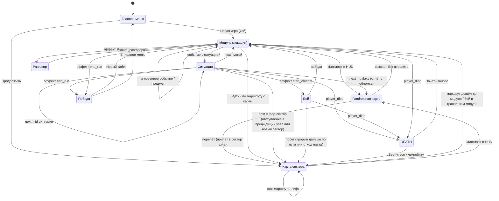

# Архитектура

Вся игровая логика живёт в автозагрузках (синглтонах) из `autoload/`. UI находится в `scenes/Game.gd` и `scenes/ui/`: он только читает состояние систем и вызывает их методы. Контент хранится в JSON в `data/` и загружается системами в `_ready()`. Модель контента описана в [CONTENT.md](CONTENT.md#модель-контента).

## Принципы

1. **`GameState` — единственный владелец переходов между экранами.** Остальные системы не переключают экраны: они эмитят сигналы или вызывают методы `GameState` (`enter_location`, `enter_situation`, `start_location_event`).
2. **Контент отдельно от кода.** Локации, события, ситуации, предметы, навыки, рецепты, враги, лор и карты описываются только в `data/`.
3. **Эффекты и условия применяются в одном месте.** Всё, что приходит из JSON в `effects`, `use_effect`, `requires` и `triggers`, проходит через `EffectResolver`.
4. **Глобальная шина только для общих событий.** В `EventBus` лежат лишь события, которые слушают несколько независимых систем. Локальные сигналы объявлены на самой системе.
5. **Единый контракт состояния.** Системы с состоянием забега реализуют `reset_for_new_run()`, `to_save_data()` и `load_save_data()`, а связывает их `SaveManager`.

## Автозагрузки

Порядок задан в `project.godot` и важен: `_ready()` вызываются именно в нём. `SaveManager` загружает meta-сейв в `_ready()`, поэтому `ArchiveSystem`, `CodexSystem` и `EconomyManager` к этому моменту уже должны существовать. `GameState` подписывается на сигналы остальных систем, поэтому стоит последним.

| # | Автозагрузка | Файл | Ответственность |
|---|---|---|---|
| 1 | `McpBridgeGame` | `mcp_bridge_game.gd` | Инструмент разработки: TCP-мост в запущенной игре. См. [MCP.md](MCP.md) |
| 2 | `SettingsSystem` | `SettingsSystem.gd` | Настройки интерфейса: размер шрифта (1×–2×), плавные переходы, скорость текста 30–180 зн./с, звук и громкость 0–100 (`user://settings.json`) |
| 3 | `NarrativeSystem` | `NarrativeSystem.gd` | Общий буфер текущего контекста: сцена, тексты, выборы, последствия, сообщения и звук появления записи |
| 4 | `EventBus` | `EventBus.gd` | Глобальные сигналы: `player_died(cause)`, `returned_to_hub()` |
| 5 | `EffectResolver` | `EffectResolver.gd` | `apply_effect(s)` и `check_requirement(s)` для словарей из JSON |
| 6 | `ResourceSystem` | `ResourceSystem.gd` | HP (база + бонус), O2 (запас в единицах) и его цены за действия, множитель среды узла, патроны; сигнал `action_taken(kind)` на каждое действие; смерть при `hp <= 0` или `o2 <= 0` |
| 7 | `InventorySystem` | `InventorySystem.gd` | Сумка: слоты (база + бонус), стаки, использовать / выбросить / взаимодействия предметов |
| 8 | `CharacterSystem` | `CharacterSystem.gd` | Снаряжение в 5 слотах, навыки и очки навыков, итоговые характеристики |
| 9 | `CraftingSystem` | `CraftingSystem.gd` | Рецепты: проверка условий и материалов, создание предмета с откатом при нехватке места |
| 10 | `ArchiveSystem` | `ArchiveSystem.gd` | Открытые лор-фрагменты (meta-слой, переживает смерть) |
| 11 | `CodexSystem` | `CodexSystem.gd` | Справочник мира из `data/codex.json`: поиск упоминаний, открытые статьи и цветовые сегменты текста (meta-слой) |
| 12 | `ChronicleSystem` | `ChronicleSystem.gd` | Хроника забегов (meta): победы, смерти, открытые финалы; тексты финалов из `data/endings.json` |
| 13 | `NotificationSystem` | `NotificationSystem.gd` | Метки «новое» на кнопках «Персонаж» и «Журнал» |
| 14 | `MapSystem` | `MapSystem.gd` | Загрузка сектора, состояния узлов, текущая палуба, лифты, клик по узлу |
| 15 | `SituationEngine` | `SituationEngine.gd` | Загрузка ситуаций, фильтр опций по `requires`, флаги забега |
| 16 | `LocationSystem` | `LocationSystem.gd` | Локации-модули: текущая локация, описание, доступность событий, визиты и выполненные события, сообщения |
| 17 | `CombatSystem` | `CombatSystem.gd` | Бой в духе Neo Scavenger: манёвры, дистанция, ИИ противника, награда за победу, эффекты `on_win`/`on_flee` |
| 18 | `ProgressionSystem` | `ProgressionSystem.gd` | Уровень и опыт забега: источники опыта, очки навыков за уровень; см. [«Уровни и опыт»](#уровни-и-опыт) |
| 19 | `NeedsSystem` | `NeedsSystem.gd` | Время, силы, голод и отдых: расход за действия, обморок, сон; см. [«Время, силы, голод и отдых»](#время-силы-голод-и-отдых) |
| 20 | `QuestSystem` | `QuestSystem.gd` | Журнал целей: мысли героя и цели из `data/quests.json`, засчитанные шаги; см. [«Цели и мысли»](#цели-и-мысли) |
| 21 | `ExplorationSystem` | `ExplorationSystem.gd` | Исследование модулей: план находки, длительность, найденные скрытые события и вытянутые события пулов `data/explore_pools.json`; см. [«Исследование модулей»](#исследование-модулей) |
| 22 | `JournalSystem` | `JournalSystem.gd` | Общий журнал забега: хронология переходов, событий, выборов, боёв, находок, сна, разговоров, целей и финала (виды записей, в том числе `rest`, `goal`, `talk`) |
| 23 | `GalaxySystem` | `GalaxySystem.gd` | Глобальная карта системы из `data/galaxy.json`: гексагональная сетка, топливо корабля, время перелёта, текущий узел; прилёт отдаёт сигналом `arrived` — сектор грузит `GameState`; см. [«Глобальная карта системы»](#глобальная-карта-системы) |
| 24 | `DialogueSystem` | `DialogueSystem.gd` | Разговоры с персонажами из `data/dialogues/*.json`: узлы, реплики, варианты ответа, условия и эффекты; экран рисует `scenes/ui/DialogueView.gd` |
| 25 | `EconomyManager` | `EconomyManager.gd` | Полный доступ, лимиты отката, rewarded-реклама через `EconomyProvider` |
| 26 | `SaveManager` | `SaveManager.gd` | `run.json`, `meta.json`, `checkpoint.json` |
| 27 | `SoundSystem` | `SoundSystem.gd` | Звуки: слушает сигналы систем, UI зовёт `play(id)` напрямую; см. [«Звук»](#звук) |
| 28 | `GameState` | `GameState.gd` | FSM экранов, запуск событий, асинхронное исследование (`explore_location`), старт, продолжение, рестарт, откат, сон (`sleep`), разговор, перелёт (`open_galaxy`), завершение забега |

Кроме автозагрузок есть два класса (не автозагрузки):
- `EconomyProvider` (`class_name`, `RefCounted`) — интерфейс платёжного и рекламного провайдера.
- `MockEconomyProvider` — заглушка, у которой покупка и реклама всегда успешны.

Реальные Android- и iOS-провайдеры должны наследоваться от `EconomyProvider` и подставляться в `EconomyManager._provider`.

## UI

| Файл | Что делает |
|---|---|
| `scenes/Game.gd` | Прокручиваемое тело экрана, закреплённые заголовки/вкладки и нижний HUD. HUD: `XpBar`; шкалы ❤️ здоровья, ⚡ сил и 🍖 питания; компактные O2, оружие, сумка, день и часы; кнопки «Карта», «Космос» (появляется, когда у героя есть корабль), «Персонаж», «Развитие», «Журнал», «Настройки». Плашка сна почасово показывает время, силы, здоровье, питание и качество. Здесь же лента, действия, оверлеи, карта, разговор и анимации |
| `scenes/ui/SectorMapView.gd` | Карта сектора: сетка, связи, отсеки по статусам, фишка игрока, маршрут, камера (перетаскивание, колесо, щипок, «＋/－/◎»), кнопки знакомых палуб; новый открытый узел фокусируется и пульсирует до 5 секунд или до нажатия |
| `scenes/ui/MarqueeLabel.gd` | Подпись в одну строку: не помещается — бегущая строка (без анимаций — многоточие) |
| `scenes/ui/CharacterPanel.gd` | Содержимое «Предметов» и «Снаряжения» экрана персонажа, а также переиспользуемый список базовых навыков для вкладки «Развитие → Навыки» |
| `scenes/ui/WorkbenchPanel.gd` | Верстак модуля-базы: все рецепты с материалами, условиями и кнопкой «Создать». Единственное место крафта в UI |
| `scenes/ui/CharacterDollView.gd` | Схематичный персонаж с кнопками пяти слотов и выносными линиями |
| `scenes/ui/UiKit.gd` | Общие хелперы: масштаб шрифта `fs()`, тексты, кнопки (`default`, `quiet`, `danger`, `exit`, `tab_active`), ползунок `slider()` под палец (толстая дорожка, крупный круглый бегунок), карточки, пиксельный арт и портреты |
| `scenes/ui/CombatView.gd` | Экран боя, прижатый к низу: журнал схватки, карточки и портреты сторон, линейка дистанции, расходники, спецдействия, сетка манёвров; эффекты ударов и лечения; после победы — только журнал и затемнённая панель награды с «Продолжить» |
| `scenes/ui/XpBar.gd` | Тонкая полоса уровня «Ур. N · полоса · xp/need» в HUD и на экране победы: набор опыта твином, всплывающее «+N опыта», вспышка нового уровня |
| `scenes/ui/GalaxyMapView.gd` | Глобальная карта системы: гексагональная сетка, узлы-иконки (`assets/art/galaxy`: звезда, планеты, астероиды, станция, обломки), подписи с временем перелёта, кольцо корабля, пунктирный маршрут к выбранной точке; камера — перетаскивание, колесо, щипок, «＋/－/◎» |
| `scenes/ui/DialogueView.gd` | Экран разговора: затемнение поверх модуля, карточка с аватаром собеседника, печатающаяся реплика и варианты ответа; кнопки активны после допечатки, последняя — «Закончить разговор» |

### Лента повествования

Экран модуля и ситуация используют **один буфер** (`NarrativeSystem`), но не смешиваются. Вход в событие очищает описание локации; внутри события новые реплики дописываются снизу. Если у события или ситуации нет своей картинки, запись `backdrop` сохраняет сверху иллюстрацию модуля; собственная `image` имеет приоритет, а `clear_image: true` у события явно убирает фон на всю связанную цепочку ситуаций. После «Продолжить» событие очищается, а буфер заполняется следующим событием или актуальными заголовком и описанием локации. `NarrativeSystem.update_head(title, image, text)` меняет только заголовок, картинку и описание в начале ленты, не трогая записей под ними (так модуль меняет вид после победы, а трофеи остаются). Записи бывают `scene` (заголовок модуля), `backdrop` (фоновая иллюстрация модуля), `text` (описание, текст события или ситуации), `choice` (реплика игрока), `result` (последствие выбора), `notice` (взял предмет, заперто, не поместилось), `goal` (обновление цели), `gain` / `loss` (изменение ресурса, предмета или опыта) и `system`. Текст новых записей открывается через `visible_ratio` после полной шейпинговой раскладки (`VC_CHARS_AFTER_SHAPING`), поэтому слово переносится до начала печати и уже показанные строки не прыгают.

Любое изменение HP, кислорода, голода, патронов, предметов и опыта видно в ленте строкой в квадратных скобках: `[−2 O2]`, `[−5 HP]`, `[−40 голода]`, `[+1 Аптечка]`, `[−1 Ключ-карта пилота]`, `[+10 опыта]`. Пишет их `EffectResolver.report_change(kind, amount, what, less_is_better = false)` (`kind`: `hp` / `o2` / `hunger` / `ammo` / `item` / `xp`; при `less_is_better` убыль — зелёная строка, как у голода) — для эффектов `hp_delta` / `o2_delta` / `hunger_delta` / `ammo_delta` с **фактическим** изменением (лечение при полном HP ничего не пишет), для `item_add` / `item_remove` — сколько реально добавилось или убрано, для опыта — `ProgressionSystem.add_xp` — и эмитит `change_reported(kind, amount)` для звука. Получение предмета или патронов кладёт `pickup` в поле `sound` записи: `Game` проигрывает его при появлении этой строки, а не в момент расчёта эффекта. Новый уровень добавляет строку `[Уровень N · +K очк. навыков]`.

Ситуация не обрывается на выборе: `SituationEngine.select_option` кладёт в ленту реплику и цену выбора, текст `result` из контента, затем применяет эффекты (их строки `[…]` встают под текстом последствия) и переходит в режим ожидания (`awaiting_continue`). Экран показывает кнопку «Продолжить», и только `confirm_continue()` эмитит `situation_ended`. Исключения — смерть и начало боя: там экран переключается сразу.

**Кнопки ждут текст.** `_render_story()` возвращает время, через которое допечатаются новые записи; `_render_situation` отсчитывает от него срок `_buttons_ready_at` и держит варианты (и «Продолжить») неактивными, пока текст печатается. Срок монотонный: перерисовка не откатывает его назад, а допечатанная запись (например, обновление цели) лишь отодвигает вперёд. После срока кнопки всплывают **по одной** (`BUTTON_REVEAL_STEP`), каждая — плавным появлением с чуть уменьшенного масштаба; включается кнопка в конце своей анимации. Без анимаций кнопки доступны сразу.

### Настройки интерфейса

`SettingsSystem` хранит в `user://settings.json` масштаб шрифта `font_scale` (1.0–2.0, по умолчанию 1.5), флаг плавных переходов, скорость появления текста `text_speed` (30–180 знаков в секунду с шагом 10, по умолчанию 90), флаг звука и громкость `sound_volume` (0–100, по умолчанию 65). Шрифт: поле `font_scale_value` (читается через `font_scale()`), `set_font_scale()`; `snap_font_scale()` притягивает значение к опорным 1 / 1.5 / 2, если оно ближе 0.08, иначе округляет с шагом 0.05. Скорость: поле `text_speed_cps`, `set_text_speed(int)`; при выключенных анимациях текст появляется сразу. Громкость: поле `sound_volume_percent`, `set_sound_volume(int)`, `sound_volume()` (0..1; 0 — тишина). Старые настройки без `text_speed` получают значение 90; старые id пресетов размера/громкости мигрируют в числа.

Подпись ползунка обновляется во время движения, а настройка применяется после отпускания, чтобы перерисовка не уничтожала захваченный бегунок. `Game._input` не начинает прокрутку ленты с ползунка, даже если палец ушёл за его границы; у размера шрифта под дорожкой остаются только подписи 1× / 1.5× / 2× без точек-рисок.

Смена любой настройки перерисовывает текущий экран (`Game._on_settings_changed`) без анимации появления тела (`_restyling` гасит `_animate_body`) и возвращает прежнюю прокрутку после раскладки — иначе каждый щелчок переключателя и отпущенный ползунок мигали бы всем экраном.

Поля экрана считает `Game._apply_safe_area()`: безопасная зона `DisplayServer.get_display_safe_area()` (вырез камеры, скругления, системные панели) переводится в координаты вьюпорта и добавляется к `CONTENT_MARGIN`. Сверху всегда есть запас не меньше `SAFE_TOP_MIN`, даже если система зону не сообщила. Пересчёт — при `size_changed` вьюпорта.

Карта (`SectorMapView`) занимает всю высоту тела между легендой и панелью маршрута: рамка и сетка растягиваются на всё место, занятые клетки текущей палубы вписываются целиком по центру (zoom 1 — масштаб по ширине и высоте, не больше `MAX_VIEW_SCALE`). Сама карта рисуется на холсте внутри рамки (`MapCanvas`, `clip_contents`): при приближении отсеки и линии за краем обрезаются. Один палец или зажатая мышь двигает камеру; щипок двумя пальцами масштабирует вокруг их середины; также работают колесо, жест тачпада и «＋/－/◎». Касание, перешедшее в жест, не нажимает отсек. `Game._input` не прокручивает ленту, если нажатие пришлось на карту. Карта из ситуации доступна только для просмотра: узлы не нажимаются, изображение обесцвечено и поверх него стоит watermark «ЗАБЛОКИРОВАНО», но камеру можно двигать и масштабировать. Переносимые надписи над картой (`Game._add_text`) получают ширину тела ещё до раскладки: иначе на первом проходе их высота считалась «по букве на строку», растянутое тело успевало вырасти и не сжималось — карта съезжала вниз при перерисовке. Шаг маршрута, туман, замок и лифт обновляют узлы на месте (`update_nodes`), не сбрасывая камеру; переход на другую палубу меняет активный этаж. Подпись отсека — `MarqueeLabel`: при переполнении едет влево, при выключенных анимациях обрезается с многоточием.
Узел, открытый сюжетным действием, но ещё не посещённый, уже показывает настоящее название и маркер 📍; полностью неизвестный узел сохраняет `?` и подпись «Неизвестно». Признак `title_known` вычисляет `MapSystem`, в сейв отдельно не записывается.
При `open_map_node` `MapSystem` также испускает `node_unlocked`: `Game` на пять секунд показывает пульсирующую карточку «Увидеть на карте». Карточка ждёт, пока лента допечатает строку «[Открыта новая локация …]», — раньше она перекрывала ещё не прочитанный текст события (`_on_map_node_unlocked` → `_queue_pending_map_reveal` → `_flush_pending_map_reveal`). Кнопка открывает карту, переключает нужную палубу, наводит камеру и запускает пульсацию самого узла до пяти секунд или до нажатия.

Заголовок и основные вкладки Журнала/Персонажа/Развития, а также подвкладки Справочника и инвентаря живут в `PinnedHeader` над `ContentScroll`; длинные списки прокручиваются под ними.

Главное меню занимает всю доступную высоту без HUD: по центру собраны пиксельная заставка `title_screen`, название, короткий столбец действий и статистика хроники; версия закреплена снизу. Заставка медленно меняет яркость, если включены анимации.

Выхода «на карту» отдельной кнопкой нет: кнопка «Карта» в HUD открывает карту поверх модуля или ситуации (см. [«Перемещение по карте»](#перемещение-по-карте)); повторное нажатие закрывает её. На самой карте кнопка только закрывает открытый поверх неё журнал, персонажа или настройки, а без них ничего не делает и экран не перерисовывает. Кнопка «Персонаж» доступна с начала игры (кроме меню, боя, смерти, победы и пути по карте); её повторное нажатие возвращает на экран под ней — в модуль, если карта была открыта поверх него.

Уведомления (`NotificationSystem`): новые предметы зажигают «Персонаж (!)», а доступная прокачка при неистраченных очках — «Развитие (!)» и вкладку «⭐ Навыки (+N)». «Журнал (!)» горит по `has_journal_alert()` — новые записи архива, справочника или новые цели (`has_new_lore()`, `has_new_codex()`, `has_new_goals()`); `mark_journal_seen()` гасит все три.

## Машина экранов

`GameState.Screen`: `MAIN_MENU`, `SECTOR_MAP`, `SITUATION`, `COMBAT`, `DEATH`, `LOCATION`, `VICTORY`, `GALAXY_MAP`, `DIALOGUE`. При каждом переходе эмитится `screen_changed`, и `Game.gd` полностью перерисовывает тело экрана.

```mermaid
stateDiagram-v2
    state "Главное меню" as MENU
    state "Карта сектора" as MAP
    state "Глобальная карта" as GALAXY
    state "Модуль (локация)" as LOC
    state "Ситуация" as SIT
    state "Разговор" as TALK
    state "Бой" as COMBAT
    state "Победа" as WIN

    [*] --> MENU
    MENU --> LOC: Новая игра (хаб)
    MENU --> MAP: Продолжить
    MAP --> LOC: маршрут дошёл до модуля / бой в транзитном модуле
    MAP --> MAP: шаг маршрута, лифт
    MAP --> GALAXY: «Космос» в HUD
    LOC --> GALAXY: «Космос» в HUD
    GALAXY --> MAP: перелёт (прилёт в сектор узла)
    GALAXY --> LOC: возврат без перелёта
    LOC --> SIT: событие с ситуацией
    LOC --> TALK: эффект start_dialogue
    LOC --> LOC: мгновенное событие / предмет
    LOC --> MAP: «Идти» по маршруту с карты
    SIT --> SIT: next = id ситуации
    SIT --> LOC: next пустой
    SIT --> MAP: next = map-сектор (отступление в предыдущий узел или новый сектор)
    SIT --> GALAXY: next = galaxy (отлёт с обломка)
    SIT --> COMBAT: эффект start_combat
    TALK --> LOC: конец разговора
    COMBAT --> LOC: победа
    COMBAT --> MAP: побег (прорыв дальше по пути или отход назад)
    SIT --> DEATH: player_died
    COMBAT --> DEATH: player_died
    LOC --> DEATH: player_died
    DEATH --> LOC: Начать заново
    DEATH --> MAP: Вернуться к чекпойнту
    SIT --> WIN: эффект end_run
    LOC --> WIN: эффект end_run
    WIN --> LOC: Новый забег
    WIN --> MENU: В главное меню
```

Поверх текущего экрана `Game.gd` умеет показывать три оверлея, которые не меняют `GameState.current_screen`:
- **Журнал** — четыре вкладки: «🎯 Цели» (первая и открывается по умолчанию; см. [«Цели и мысли»](#цели-и-мысли)), «📜 Хроника» (записи `JournalSystem` — что уже произошло в забеге, свежие сверху, у каждой записи остаток O2), «🗄️ Архив» (лор-фрагменты `ArchiveSystem`) и «📚 Справочник» (`CodexSystem`) с подвкладками «Места», «Люди», «Корабли», «Термины». Первое упоминание понятия открывает статью, красит это понятие в текстах и ставит «(!)». Кнопки «Закрыть» нет — журнал закрывается той же кнопкой «Журнал» в HUD. Недоступен в главном меню, в бою, на экране смерти и победы.
- **Карта** — поверх модуля по ней прокладывается маршрут (выход из модуля — при «Идти»), поверх ситуации она серая, помечена «ЗАБЛОКИРОВАНО» и доступна только для перемещения/масштабирования камеры; отдельной кнопки закрытия нет, повторное нажатие «Карта» в HUD возвращает к ситуации. В бою, на экране смерти и до загрузки сектора недоступна.
- **Персонаж** — `CharacterPanel`. Недоступен в главном меню, в бою, на экране смерти и на экране победы. При закрытии в модуле вызывается `GameState.refresh_location()`: предметы могли измениться, и автособытия перепроверяются.

Любая смена экрана закрывает оверлеи.

## Ключевые потоки

### Новая игра

`GameState.start_new_game()`:
1. `SaveManager.start_new_run()` сбрасывает все системы по `config.json` и удаляет `run.json` и `checkpoint.json`. `CharacterSystem` надевает `start_equipment` и выдаёт `start_skill_points`.
2. `MapSystem.load_sector(start_sector_id)` загружает стартовый сектор.
3. Если задан `opening_situation_id`, открывается эта ситуация. Иначе игрок уже стоит в хабе (`MapSystem.player_node_id`) и входит в него (`MapSystem.travel_to(hub)`), вступление проигрывается его автособытиями.

### Перемещение по карте

Игрок стоит в узле — `MapSystem.player_node_id` (в сейве вместе с узлом, откуда он пришёл). Новый сектор начинается в хабе. Путь — по связям узлов (`connections`, в обе стороны); поездка на лифте — шаг между двумя связанными лифтами разных палуб.

1. **Маршрут.** Нажатие на отсек → `MapSystem.plan_route(id)`: Дейкстра по кислороду через видимые незапертые узлы. Запертый узел может быть только целью и только при ключе в сумке (ключ срабатывает, когда игрок дойдёт); без ключа — отказ с причиной и `node_blocked`. Цель-лифт означает поездку: путь заканчивается в парном лифте. Цена шага: вход в модуль — `move` по модулю (без давления дороже), поездка — `elevator` по лифту отправления, шаг на лифт без поездки и узлы без модуля — бесплатно. План: `{ ok, path, cost, message }`.
2. **Показ.** `Game` рисует маршрут на карте (жёлтая линия, кольцо у цели) и под картой: отсеки по пути, `≈ −N O2 · останется M`, предупреждения — кислорода не хватит, «Внимание! Мало кислорода!», по пути враг (`hostile`) или неизвестные отсеки, игрок измотан. Пока маршрут не выбран, панель под картой пустая. Кнопки «Идти» и «Отмена»; повторное нажатие на ту же цель — тоже «Идти».
3. **Путь.** `MapSystem.start_travel(id)`, дальше шаги: UI ведёт фишку игрока к следующему узлу (`peek_travel_step`), камера приближается и ведёт её, затем `travel_step()` исполняет шаг — тратит кислород (и силы), отмечает узел разведанным, на поездке меняет палубу. Итоги шага: `moved`, `arrived` (дошли до лифта — камера показывает палубу целиком), `entered` (вошли в модуль), `dead`. Если силы кончились в пути, игрок вырубается на месте (`NeedsSystem.passed_out`), и `Game` пишет причину под картой. Кнопка «Стоп» — `cancel_travel()`; в пути кнопки HUD заперты. Без анимаций шаги идут без пауз в движении. Смоук-тест и старт игры ходят сразу до конца — `travel_to(id)`.
4. **Перехват.** Транзитный модуль останавливает игрока, только если вход в него начнёт бой: `MapSystem._would_intercept` смотрит `LocationSystem.peek(location_id, true).combat` — есть доступное автособытие, чьи `effects` или варианты ситуации содержат `start_combat` (`LocationSystem.is_combat_event`, `SituationEngine.situation_starts_combat`). Маршрут приостанавливается, и игрок входит в модуль как обычно; экран модуля (`GameState._show_location`) заканчивает маршрут. Прочие автособытия (сообщения первого взгляда, предупреждения, находки) путь не прерывают — они сработают, когда игрок войдёт в модуль сам. Случайных событий в контенте пока нет.
5. **Прорыв и отступление.** Побег из боя, начатого перехватом, — прорыв: `resume_travel_after_flee()` продолжает путь за врага. Побег без продолжения и отступление в ситуации (`next: "map:<этот сектор>"`) — `MapSystem.retreat()`: игрок возвращается в узел, откуда пришёл, и мимо врага без боя не пройти. `next: "map:<другой сектор>"` загружает сектор, игрок — в его хабе.

Карта из модуля открывается кнопкой «Карта» поверх экрана модуля: по ней можно проложить маршрут, а из модуля игрок выходит (`GameState.leave_location`), только когда тронется в путь. Повторное нажатие «Карта» (или «Персонаж» после неё) возвращает в модуль. Из ситуации карта только для просмотра.

Видимость: узел виден, если игрок в нём был, или он на знакомой палубе и соседний с разведанным (после `reveal_map` — любой на знакомой палубе). Знакомые палубы (`get_known_floor_ids`) — только те, где игрок уже стоял: до первой поездки на лифте другие палубы на карте не показываются вовсе. Узлы с `map.hidden_until_open: true` скрыты, пока их не откроет эффект `open_map_node`.

Цвет узла — статус `MapSystem.get_node_status`: `base` (зелёный, база), `events` (жёлтый: доступные действия, ждущее автособытие, вещи на полу или есть что исследовать — `LocationSystem.peek`, поле `explore`), `locked` / `door` (синий: остались действия под ключ / запертый узел), `empty` (серый), `hostile` (красный: узел `dangerous`), `elevator` (голубой, значок 🛗), `unknown` (ещё не был внутри). Подпись лифта собирается сама — «Лифт к <label палубы>» по `target_floor` (например, «Лифт к 02», «Лифт к B»); `map.label` у лифтов не задаётся. Над картой — легенда (база — «База: сон, сохранение и склад»); у отсеков без давления значок 💨.

### Глобальная карта системы

Верхний уровень мира: не отсеки корабля, а точки системы — звезда, планеты, скопления астероидов, станции и обломки. Данные лежат в `data/galaxy.json` (схема — [CONTENT.md](CONTENT.md#глобальная-карта-системы--galaxyjson)), состояние держит `GalaxySystem`, рисует `scenes/ui/GalaxyMapView.gd`, экраном владеет `GameState` (`Screen.GALAXY_MAP`).

- **Узлы.** Плоская гексагональная сетка (axial-координаты `q`/`r`): `GalaxySystem.hex_to_pixel` переводит их в пиксели, `hex_distance` считает путь. Узел с `sector_id` — точка, где можно сесть: прилёт грузит соответствующий сектор карты отсеков. Узел без `sector_id` — ориентир: панель объясняет, что это, но перелёт недоступен.
- **Корабль.** Появляется, когда выставлен флаг из `ship.unlock_flag` (id флага — контент, не код): `has_ship()` читает его через `SituationEngine`. Пока корабля нет, кнопки «Космос» в HUD не видно.
- **Топливо и время.** `travel_fuel(node)` — `fuel_per_hex × расстояние` (или `fuel_cost` узла), `travel_hours(node)` — `hours_per_hex × расстояние` (или `hours`). Перелёт списывает топливо (`apply_fuel_delta`), тратит голод и продвигает часы (`NeedsSystem.advance_time`), пишет запись `move` в журнал; топливо пополняют эффекты `fuel_delta` из контента.
- **План и отказ.** `plan_travel(id)` возвращает `{ ok, message, fuel, hours, distance }` — как `MapSystem.plan_route`: панель под картой показывает и цену, и причину отказа («Мало топлива…», «Данных об этой точке нет — маршрут не рассчитан», «Сюда не летят: нет посадки»).
- **Прилёт.** `travel_to()` (или кнопка «Лететь») заканчивается сигналом `arrived`: `GameState` грузит сектор и показывает карту отсеков. Положение корабля держит `GalaxySystem.sync_node_for_sector` — он подписан на `MapSystem.sector_loaded`, поэтому узел карты системы всегда совпадает с загруженным сектором: новая игра, загрузка сейва, отступление и прилёт идут через одну точку.
- **Карта.** Сетка рисуется целиком, чтобы пустые гексы давали масштаб; занятые несут иконку `assets/art/galaxy/<тип>.png`, подпись с временем перелёта и состояние (недоступные — приглушены). Корабль помечен кольцом и шевроном, выбранная точка — белым кольцом, к ней идёт пунктир со стрелкой. Камера: перетаскивание, колесо, щипок, «＋/－/◎»; вписать все узлы — начальное состояние.
- **Сейв.** `galaxy` в `run.json`: система, текущий узел, топливо и посещённые точки.

### Разговоры с персонажами

Разговор — отдельный экран (`Screen.DIALOGUE`) поверх модуля: затемнение, карточка с аватаром собеседника, печатающаяся реплика и варианты ответа. Логика в `DialogueSystem` + `data/dialogues/*.json` (схема — [CONTENT.md](CONTENT.md#диалоги--datadialoguesjson)), рисует `scenes/ui/DialogueView.gd`.

- **Запуск.** Эффект `start_dialogue` (`{ "type": "start_dialogue", "dialogue": "<id>" }`) вызывает `DialogueSystem.start()`; система эмитит `dialogue_started`, и `GameState` переключает экран — так же, как бой открывается эффектом `start_combat`. Из локации разговор запускают ручные события (в них можно требовать флаги и показывать свой текст до разговора).
- **Узлы и варианты.** Узел — реплика собеседника (`speaker`, `text`, необязательные `image` и `effects`), варианты — `id`, `label`, `next` (пустой — конец разговора), `requires` и `effects`. Вариант с `once: true` исчезает после выбора: одноразовые темы. Узел входа — первый подходящий из `entries` (у каждого свой `requires`), иначе `entry`.
- **Эффекты и условия.** Варианты и узлы применяют эффекты через `EffectResolver` (`flag_set`, `unlock_lore`, `unlock_knowledge`, `skill_points_add`, `practice_add`, `item_add`…), условия — те же, что в контенте, плюс `dialogue_done` (разговор уже закончен в этом забеге). Кнопка «Закончить разговор» есть всегда: игрок не заперт в диалоге.
- **Поток.** `DialogueView` читает `DialogueSystem.get_state()` и передаёт выбор обратно; кнопки включаются после допечатки реплики. Конец разговора (`dialogue_ended`) закрывает оверлей и возвращает экран модуля, а буфер ленты восстанавливает описание локации; в журнал уходит одна запись `talk` на разговор, повторные — без дублей.
- **Сейв.** `dialogue` в `run.json`: завершённые разговоры и выбранные одноразовые реплики. Незаконченный разговор не сохраняется: автосохранение бывает только в модуле и на карте, где диалог уже закрыт.

### Модуль и события

1. **Вход.** `GameState.enter_location()` вызывает `LocationSystem.enter()`: визит +1, сбрасывается список «сработало в этом визите», а в ленту уходит новая сцена — заголовок, иллюстрация и описание модуля.
2. **`_resume_location()`** в цикле берёт `LocationSystem.next_auto_event()` — первое автособытие, доступное по правилам:
   - разовое ещё не завершено;
   - в этом визите не срабатывало;
   - `triggers` выполнены.
3. **`_run_event(ev)`:**
   - очищает описание модуля из общего буфера;
   - `LocationSystem.mark_started()` ставит только отметку «сработало в визите»;
   - `text`, `image` и `sound` события уходят в буфер;
   - применяются `effects` (их сообщения ложатся следом);
   - если задан `situation`, открывается ситуация;
   - мгновенное событие без ситуации сразу помечается выполненным.

   Если событие увело игрока с экрана модуля (ситуация, бой, смерть), цикл прерывается. Иначе проверяется следующее автособытие. Предохранитель — 32 события за шаг.
4. **Экран модуля.** Когда автособытий не осталось, `_show_location()` показывает экран `LOCATION`. Если это модуль хаба или модуль-база, записывается чекпойнт. В разделе «Действия» — кнопка исследования (см. [«Исследование модулей»](#исследование-модулей)) и доступные ручные события, кроме ещё не найденных скрытых (`discover`).
5. **Ручное событие.** `GameState.start_location_event(id)` проверяет замок, списывает кислород (и силы), кладёт в ленту реплику игрока (label) и её цену `[−3 O2]` (в пригодном для дыхания модуле цены нет) и запускает событие через тот же `_run_event`, затем снова `_resume_location()`. Скрытое ненайденное событие запустить нельзя (`LocationSystem.is_event_available` → `false`).
6. **Предметы.** Сумочные предметы вне боя используются во вкладке «Персонаж → Предметы → Сумка». Вещи, лежащие в модуле, показаны отдельными карточками: «Применить» вызывает `LocationSystem.stash_use()` и расходует один расходник, «Подобрать» переносит сколько поместится. После закрытия персонажа и применения вещи модуль перепроверяет автособытия.
7. **Выход.** Маршрут с карты (кнопка «Карта» в HUD) → `GameState.leave_location()` → игрок идёт по пути.

### Исследование модулей

Часть ручных событий модуля скрыта (`discover: true`): их нет в меню, пока игрок их не найдёт. Кроме них у локации может быть пул случайных событий (`explore: { pool, rolls, duration }`, пулы — `data/explore_pools.json`). Состояние забега хранит `ExplorationSystem`: найденные события (`_discovered`, ключи `локация/событие`) и вытянутые события пулов (`_drawn`, локация → id). Схема — в [CONTENT.md](CONTENT.md#исследование--explore_poolsjson).

1. **Кнопка.** Раздел «Действия» начинается с «🔍 Исследовать отсек · осталось N из M» (`ExploreButton`). Если остались только скрытые события, чьи `triggers` ещё не выполнены, — неактивная «🔍 Пока искать нечего · осталось N из M»; если не осталось ничего — неактивная «🔍 Отсек исследован полностью».
2. **Счётчик.** Всего `M = discover-событий + rolls + бонус навыка` (`ExplorationSystem.total`); осталось `N` — ненайденные скрытые события (`LocationSystem.hidden_event_count`, в том числе пока недоступные) плюс оставшиеся броски пула (`rolls_left`, не больше неиспользованных записей пула).
3. **План.** `ExplorationSystem.prepare()` заранее выбирает скрытое событие или взвешенную запись пула и число тактов из `duration: [min, max]`. План фиксирован до конца поиска.
4. **Анимация и цена.** `GameState.explore_location()` очищает ленту и показывает реплику. `Game` открывает по центру блокирующую плашку: она плавно появляется, шкала линейно заполняется всё время поиска, подпись обновляется по тактам, после результата плашка плавно гаснет. Каждые 0,5 секунды списывается `explore_tick`; HUD и остальные действия заблокированы. После последнего такта один `action_taken("action")` списывает силы и голод. В пригодном для дыхания модуле цена O2 равна нулю и UI пишет «воздух отсека».
5. **Результат.** `ExplorationSystem.resolve(plan)` либо вызывает `reveal(event_id)` (текст `found`, строка «[Найдено: <label>]», событие появляется в меню), либо добавляет id пула в `_drawn`, показывает текст и применяет эффекты. Затем `_resume_location()` возвращает меню.
6. **Позже.** Скрытое событие с невыполненными `triggers` не находится, но остаётся в счётчике и станет находимым, когда условия выполнятся.
7. **Карта.** `LocationSystem.peek()` возвращает `explore` (остались броски пула или есть находимое скрытое событие), и `MapSystem` красит такой узел как `events` («Есть что сделать»).
6. **Навык «Поиск»** (`scavenging`): `explore_rolls` добавляет броски в каждом модуле, `find_chance` — шанс, что каждый `item_add` из пула даст на 1 предмет больше.

Вспомогательное в `LocationSystem`: `get_explore`, `findable_events`, `discover_event_count`, `hidden_event_count`; скрытые события исключены из `get_manual_events()`.

### Выбор опции в ситуации

`SituationEngine.select_option(id)`:
1. Списывает цену `choice` по кислороду (и силам), кладёт в ленту реплику игрока (`label`) и цену `[−2 O2]` (в пригодном для дыхания модуле цены нет).
2. Кладёт в ленту `result` варианта.
3. Применяет `effects` через `EffectResolver` — их изменения ресурсов и предметов ложатся строками `[…]` под текстом последствия.
4. Если игрок умер — останавливается: экран смерти выставит `GameState` по `EventBus.player_died`. Если начался бой — тоже останавливается, экран уже переключён.
5. Иначе переходит в `awaiting_continue`: UI показывает кнопку «Продолжить».

`SituationEngine.confirm_continue()` (кнопка «Продолжить» или `GameState.finish_situation`) эмитит `situation_ended(id, next, completes_event)`, и `GameState` его обрабатывает:
- Терминальный вариант с `completes_event: true` помечает связанное событие выполненным; `false` оставляет его доступным для повторной попытки.
- `next = ""` → буфер события очищается, актуальное описание текущего модуля восстанавливается через `_resume_location()`. Если игрок не в модуле — переход на карту.
- `next = "map:<sector>"` → выход из модуля, (пере)загрузка сектора, карта, `returned_to_hub` (чекпойнт).
- `next = "<situation_id>"` → буфер очищается и начинается следующая ситуация той же цепочки.

### Персонаж, базовые навыки и крафт

- **Сумка и снаряжение разделены.** `InventorySystem` хранит только сумку. Надетые предметы лежат в `CharacterSystem.equipment` (`слот → id`) и слотов сумки не занимают. Информационные предметы — `quest` и `key` (`InventorySystem.is_info_item`) — лежат в сумке, но мест не занимают (`slot_cost: 0`); `load_save_data` обновляет `slot_cost` слотов из контента (старые сейвы), а `spill_overflow` их никогда не вываливает на пол.
- **`CharacterSystem.equip(id)`:**
  - переносит предмет из сумки в его `equip_slot`;
  - прежний предмет слота возвращается в сумку;
  - заранее проверяется, хватит ли места с учётом меняющегося бонуса слотов. Иначе возвращается текст ошибки, а состояние не меняется.
- **`unequip(slot)`** — обратная операция с той же проверкой.
- **`_recalculate()`** складывает `stats` надетых предметов и `per_level × уровень` навыков, затем:
  - выставляет `InventorySystem.bonus_slots` (итог: `max_slots = base_slots + bonus_slots`);
  - выставляет бонус к макс. HP (`ResourceSystem.set_max_hp_bonus`: `max_hp = base_max_hp + бонус`, текущее HP обрезается сверху);
  - эмитит `changed`.
- **Навыки.** `learn(skill_id)` тратит `cost` очков, если уровень ниже `max_level`. Очки выдают эффект `skill_points_add` и новый уровень персонажа (`CharacterSystem.add_skill_points`).
- **Условие `has_item`** считает и сумку, и надетое. Поэтому надетая труба по-прежнему открывает шлюз.
- **Эффект `item_remove`** сначала убирает из сумки, затем надетый экземпляр.
- **`CraftingSystem.craft(id)`:**
  1. проверяет `requires` и материалы (только в сумке);
  2. списывает материалы и добавляет результат;
  3. если результат не влез — убирает добавленное и возвращает материалы.

### Уровни и опыт

`ProgressionSystem` хранит уровень (`level`, с 1) и опыт внутри уровня (`xp`) — состояние забега: новая игра и смерть их обнуляют. Награды лежат в `data/config.json` → `xp` (пропущенные ключи — из `ProgressionSystem.DEFAULT_CONFIG`).

| Источник | Ключ `xp` | Когда начисляется |
|---|---|---|
| разведка | `explore` | первый вход в модуль, кроме модуля-базы (`LocationSystem.location_entered` при `visits == 1`) |
| крафт | `craft` | каждый созданный предмет (`CraftingSystem.crafted`) |
| лор | `lore` | эффект `unlock_lore` → `ProgressionSystem.lore_read(id)`: за каждый фрагмент один раз за забег (`_lore_rewarded`), хотя сам архив — meta и переживает смерть |
| победа | `kill` | победа в бою; поле `xp` врага в `enemies.json` заменяет общую награду (`kill_reward`) |

До следующего уровня нужно `level_base + level_step × (уровень − 1)` опыта (`xp_to_next()`; при 50 / 25 — 50, 75, 100…). `add_xp(amount)` переносит излишек на следующие уровни, за каждый уровень выдаёт `skill_points_per_level` очков навыков, пишет в ленту `[+N опыта]` и `[Уровень N · +K очк. навыков]` и эмитит `xp_gained(amount, levels)`; `changed()` — уровень выставлен без начисления (новый забег, загрузка сейва).

UI: полоса `XpBar` над HUD. Набор опыта и новый уровень анимируются; на экране боя это делает экран победы. Строка уровня и опыта базовых навыков находится в «Развитие → Навыки».

### Кольцевое дерево, знание и происхождения

- **`SkillTreeSystem`** — автозагрузка (после `CharacterSystem`): читает `data/skill_tree.json`, `data/knowledge.json`, `data/origins.json` и держит состояние дерева. Покупка узла тратит `CharacterSystem.skill_points` через `spend_skill_points`; покупку не заменяет, а дополняет базовые навыки `skills.json` (внутреннее кольцо): характеристики обоих слоёв складываются в одном пересчёте.
- **Три замка узла** — предыдущие узлы, знание (`knowledge.json`) и практика. Практика — счётчики значимых действий забега, растут эффектом `practice_add`. Знание — meta-слой: `to_meta_save_data`/`load_meta_save_data` кладут его в `meta.json`, поэтому найденное направление не открывают заново. Узлы, практика, происхождение и открытые сектора — состояние забега (`to_save_data`).
- **Сектора дерева** не видны целиком: происхождение открывает стартовые, остальные — эффектом `reveal_sector` или знанием с `reveal_sectors`. Узел `hidden` показывает «?», пока не получено его знание.
- **Происхождение** применяется в `SaveManager.start_new_run(origin_id)`: бесплатные стартовые узлы, знание, предметы, ресурсы, очки. `GameState.start_new_game(..., origin_id)` пробрасывает выбор экрана создания героя; без происхождения (тесты, отладка) дерево открыто целиком. Происхождение переживает смерть: `start_new_run("")` берёт текущее из `SkillTreeSystem`.
- **Метки (`tags`) узлов и происхождений** — точки расширения механик: `SkillTreeSystem.has_tag(...)` читают `CombatSystem` (`combat:first_shot`, `combat:range_control`, `combat:suppression`), `ResourceSystem` (`pilot:docking`, `eng:power_reroute`) и контент через условие `tag`.
- **Состояние и статистика.** `tree_stats()` (узлы + происхождение) уходит в `CharacterSystem.set_tree_stats`, откуда попадает в общий `_recalculate`; `has_available()` питает значок «(!)» кнопки «Развитие».
- **UI** — оверлей «Развитие» с закреплёнными вкладками «🌐 Дерево» (`SkillTreePanel`) и «⭐ Навыки» (базовые навыки `CharacterSystem`). В кольце вокруг внешнего радиуса зарезервирован пояс подписей, поэтому линии не заходят на названия секторов. Экран создания героя показывает по одной листаемой анкете с портретом, структурированными полями и индикатором страниц; сюжетные крючки до пробуждения не раскрывает.

### Кислород

O2 — не таймер, а запас в единицах: реальное время его не трогает, `ResourceSystem` не имеет `_process`. Кислород тратится на действия игрока, цены лежат в `data/config.json` → `o2_costs` и читаются `ResourceSystem` при старте (контент, в сейв не попадают).

| Цена | Действие | Кто списывает |
|---|---|---|
| `move` | Вход в модуль — цель маршрута или транзитный модуль по пути | `MapSystem.travel_step` (по модулю) |
| `elevator` | Поездка на лифте — шаг маршрута между лифтами палуб | `MapSystem.travel_step` (по лифту отправления) |
| `action` | Запуск ручного события; один раз в конце длительного исследования — силы и голод | `GameState.start_location_event`, `ResourceSystem.finish_action` |
| `explore_tick` | Один полусекундный такт исследования; число тактов задаёт `location.explore.duration` | `GameState.explore_location` |
| `choice` | Выбор варианта в ситуации | `SituationEngine.select_option` |
| `combat_turn` | Ход в бою (атака, защита, побег, предмет, обломок, спецдействие) | `CombatSystem.player_action` |

В узле без давления (`sealed: false`) цена умножается на `config.o2_unsealed_multiplier`, в модуле с `breathable: true` — на 0 (кислород не тратится). Множитель среды — публичный `ResourceSystem.environment_multiplier(node_id)`. Среду определяет узел: для перехода — узел назначения, для остальных действий — узел текущего модуля.

**Ёмкость баллона.** `ResourceSystem.max_o2 = base_max_o2 + max_o2_bonus` (из `config.max_o2`): `apply_o2_delta` обрезает запас сверху, поэтому ни баллоны, ни `o2_delta` не копят кислород бесконечно. Эффект `max_o2_add` вызывает `add_max_o2_bonus` — так крафтовый «Набор для баллона» наращивает ёмкость. Порог тревоги HUD и звука — `ResourceSystem.low_o2()` (четверть ёмкости, но не меньше 25), а не константа: при малом баллоне предупреждение не срабатывает на почти полном запасе.

Всё списывает `ResourceSystem.spend_o2(kind, node_id = "")`. Он эмитит `action_taken(kind)` на каждое действие, даже если цена по кислороду 0 (на это подписан `NeedsSystem`), и возвращает `false`, если баллон опустел: вызывающий код обязан прервать действие — игрок уже мёртв, и экран смерти выставит `EventBus.player_died`. Поэтому переход без кислорода не заводит игрока в модуль, а ход в бою заканчивает бой результатом `died`.

Кислорода **не стоят** использование предметов вне боя, подбор вещей с пола, крафт и экран персонажа: это противовес расходу, а не действие на выживание. Расходник в бою — это ход и стоит `combat_turn`. Пополняют запас только эффекты `o2_delta` из контента (баллоны, медицинская линия).

### Ключи и замки

Предмет-ключ описан полем `unlocks: ["<id замка>", ...]` и категорией `key`; такие предметы не занимают слот сумки (`slot_cost: 0`) и не выбрасываются. Замок в контенте — словарь `{ "key": "<id замка>", "consume": bool, "text": "..." }`, он ставится:
- на узел карты (`sectors/*.json`, узел в состоянии `locked`) — «закрытый отсек»;
- на ручное событие локации (`events[].lock`) — «запертый ящик».

Проверку и открытие делает `EffectResolver`: `can_open_lock`, `open_lock` (тратит ключ при `consume: true`), `lock_hint` (текст для UI). Поиск ключа в сумке и в снаряжении — `InventorySystem.find_key`.

- **Узел.** Запертый узел с замком можно выбрать целью маршрута, только если ключ в сумке: замок открывается, когда игрок до него дошёл (`available`, запись в журнал забега). Без ключа маршрута нет — сигнал `node_blocked`, и `Game.gd` пишет причину под картой. У неразведанного узла название ключа не раскрывается.
- **Событие.** Запертое событие видно в меню модуля неактивной кнопкой с подсказкой, какой ключ нужен. `GameState.start_location_event` проверяет замок до списания кислорода, затем открывает его.
- **Условие `has_key`** (`{ "type": "has_key", "lock": "..." }`) позволяет описывать в контенте любые проверки «есть ли ключ».

### Модуль-база

Локация с `base: true` (сейчас `hub` и `crew_quarters`; обе ещё и `breathable: true`) — точка возврата забега:
- при показе её экрана пишется чекпойнт;
- `sleep_quality` задаёт качество сна: `normal`, `good` или `excellent` (без поля — `normal`);
- в разделе «База» есть три варианта сна — 4 / 8 / 12 часов (`GameState.sleep(hours)` → `NeedsSystem.sleep(hours, quality)` → `_show_location()`), «Верстак» и список выгрузки сумки на склад;
- склад — обычный `LocationSystem` stash модуля и сохраняется в `run.json`.

### Время, силы, голод и отдых

`NeedsSystem` хранит `day` (с 1), `time_minutes` (0…1435 с шагом 5), `energy` и `hunger`. Стартовое время и цены — `data/config.json → needs`.

- **Время.** Каждый `ResourceSystem.action_taken(kind)` продвигает часы на `time_costs[kind]`; при переходе через 24:00 растёт день. Текущие `День N · HH:MM` видны в HUD и сохраняются блоком `needs`.
- **Расход.** То же действие тратит `energy_costs[kind]` сил и добавляет `hunger_costs[kind]` голода. Действия в пригодном для дыхания модуле тоже требуют сил и времени.
- **Измотан / голоден.** Ниже `tired_energy` действует штраф к точности; от `hungry_hunger` расход сил умножается на `hungry_energy_multiplier`. На полном голоде каждое действие снимает `starving_hp` HP.
- **Обморок.** При нуле сил вне боя проходит `pass_out_hours` (сейчас 4 часа) — это `poor`-сон: силы возвращаются лишь на `SLEEP_QUALITIES.poor.energy` от почасовой нормы, здоровья почти нет; сверх сна тратятся `pass_out_o2` кислорода и `pass_out_hunger` питания. В бою силы остаются на нуле.
- **Сон.** На базе выбираются 4 / 8 / 12 часов. Восстановление сил и HP считается по часам и множителю качества; питание расходуется по `sleep_hunger_per_hour`. `rest_completed(result)` запускает блокирующую плашку: часы идут по одному, рядом показаны фактические `+силы`, `+HP`, `−питание` и качество. После сна пишется чекпойнт.
- **Еда.** Эффект `hunger_delta` с отрицательным значением возвращает питание.

Сигнал `changed()` обновляет шкалы и часы. При первом переходе в голод/усталость и затем раз в 8 секунд `SoundSystem` играет `low_need`.

### Цели и мысли

`QuestSystem` читает `data/quests.json` (схема — в [CONTENT.md](CONTENT.md#цели-и-мысли--questsjson)) и хранит состояние забега: начатые и выполненные цели, засчитанные шаги.

- **Мысли** — `get_thoughts()`: текст первого варианта `thoughts`, чьи `requires` выполнены (поздние этапы сюжета идут первыми, последний вариант — без условий).
- **Старт** — цель начинается, когда выполнен её `start` (без поля — сразу при первой проверке).
- **Шаги** — шаг засчитывается, как только выполнен его `done`; цель выполнена по своему `done`, а без него — когда засчитаны все шаги. Всё засчитанное защёлкивается и не откатывается (например, если предмет потом израсходован).
- **Видимость** — видны засчитанные шаги (✓) и первый незасчитанный не скрытый (▸ текущий); дальнейшие не раскрываются. Шаг с `hidden: true` (улика) не виден, пока не засчитан.
- **Проверка** — `refresh()` зовётся в конце `EffectResolver.apply_effects` и в `LocationSystem.mark_completed`. Он кладёт в ленту строки «[Новая цель: …]» (вид `notice`), «[✓ шаг]» и «[Цель выполнена: …]» (вид `gain`), пишет в журнал записи вида `goal` («Новая цель: …», «Цель выполнена: …»), зовёт `NotificationSystem.mark_goals_new()` и эмитит `changed`.
- **API** — `get_quests()` (`{ id, title, description, completed, steps: [{ text, done, current }] }`, только видимые шаги), `is_completed(quest_id)`, `is_step_done(quest_id, step_id)`.

UI: вкладка «🎯 Цели» в журнале (`Game._render_journal`) — карточка «💭 Мысли», раздел «Цели» с карточками активных целей (заголовок, описание, шаги ✓/▸), затем «Выполнено». При новых целях подпись вкладки получает «(!)», а кнопка HUD — «Журнал (!)». Сохраняется блоком `quests`.

### Пиксельный арт

Картинки лежат в `assets/art`: сцены 160×96 (`scenes/<image>.png`; `death_o2` и `death_hp` — иллюстрации экрана смерти), заставка главного меню 240×150 (`scenes/title_screen.png`), иконки предметов 16×16 (`items/<item_id>.png`) и боевые портреты 64×64 (`portraits/`, `enemies/`). Генератор — `tools/make_pixel_art.py` (чистый Python, без зависимостей), он же документирует, как нарисован каждый кадр. Состояния одного отсека рисуются общими хелперами комнаты (`_cargo_bay` / `_comms_hall`: `cargo_drone` и `cargo_drone_down`, `comms_sentry` и `comms_sentry_down`); новые кадры добавляются в конец `SCENES`, чтобы не сдвинуть seed остальных.

Контент ссылается на сцены полем `image` у ситуации, локации, варианта описания локации (`descriptions[].image`) и события (см. [CONTENT.md](CONTENT.md)). Показывает их `Game.gd`: на экране ситуации — её картинка, на экране модуля — картинка события, если оно сработало, иначе `LocationSystem.get_image()`: картинка первого варианта описания, чьи `requires` выполнены (`_active_variant`), а если у варианта её нет — картинка самой локации. Так грузовой отсек после победы над дроном показывает `cargo_drone_down`, зал связи после турели — `comms_sentry_down`. Иконки предметов подтягиваются по id автоматически: они видны в сетке сумки, в карточках предметов, в кнопках расходников боя и в трофеях экрана победы.

Загрузка и масштабирование — в `UiKit`: `scene_art` (заданная ширина, высота по пропорции), `item_icon` и `portrait`, все с фильтром `TEXTURE_FILTER_NEAREST`, иначе пиксели мылятся.

### Звук

Звуки — короткие эффекты `assets/sounds/<id>.wav` (моно, 16 бит, 44.1 кГц; импорт Godot сжимает их в QOA). Их переносит из библиотеки «400 Sounds Pack» скрипт `tools/import_sounds.py`: берёт файлы по таблице `SOUNDS`, сводит в моно, срезает тишину и выравнивает громкость к целевому RMS, поэтому в коде громкость звуков не подкручивается. Новый звук = строка в `SOUNDS` скрипта + id в `SoundSystem.SOUNDS`.

`SoundSystem` — последняя автозагрузка перед `GameState`: восемь `AudioStreamPlayer` (лишний звук вытесняет самый старый), один и тот же id не повторяется чаще `REPEAT_GUARD_MS` (россыпь находок звучит один раз). Громкость — `SettingsSystem.sound_volume()`, при выключенном звуке `play()` ничего не делает. В `--headless` (смоук-тест) звуки не грузятся и не играют.

| id | Когда | Кто вызывает |
|---|---|---|
| `ui_click` | нажатие любой кнопки `UiKit.button` и кнопок HUD | UI |
| `map_open` | кнопка «Карта» открывает карту поверх модуля или ситуации | `Game._toggle_map` |
| `door` / `elevator` | вход в модуль / поездка на лифте | `LocationSystem.location_entered` / `MapSystem.elevator_used` |
| `shuttle_door` | вскрытие шлюза к пиратскому шаттлу; задаётся полем `sound` события | `NarrativeSystem` / `Game._reveal_story_entry` |
| `step` | шаг игрока по карте (в том числе отступление) | `MapSystem.player_moved` |
| `pickup` | предметы или патроны из эффекта — при появлении соответствующей строки ленты | `Game._reveal_story_entry` по полю `NarrativeSystem.entries[].sound` |
| `heal` / `hurt` | HP из эффекта выросло / упало | `EffectResolver.change_reported` |
| `o2_refill` | кислород из эффекта вырос (цена действий не озвучивается) | `EffectResolver.change_reported` |
| `unlock` / `locked` | замок открыт ключом / узел карты заперт | `EffectResolver.lock_opened` / `MapSystem.node_blocked` |
| `lore`, `craft`, `equip` | запись в архиве, крафт, надеть или снять предмет | `ArchiveSystem`, `CraftingSystem`, `CharacterPanel` |
| `low_o2` | кислород опустился до `ResourceSystem.low_o2()` (раз на переход через порог; при смерти от удушья — только `death`) | `ResourceSystem.o2_changed` |
| `low_need` | низкие силы или питание: при входе в состояние и затем раз в 8 секунд на активном экране | `NeedsSystem.changed` / `SoundSystem` |
| `shot`, `hit`, `hurt`, `miss` | удары хода в бою, в ритме эффектов `CombatView` (звучат и при выключенных анимациях); брошенный обломок — `hit` / `miss` без выстрела, лечение расходником — только `heal` из `EffectResolver` | `CombatView._play_turn` |
| `combat_start` / `combat_won` | экран боя / итог «Победа» | `GameState.screen_changed` / `CombatView` |
| `xp` / `level_up` | начислен опыт / взят новый уровень; на экране боя молчат — их в такт набору опыта играет экран победы | `ProgressionSystem.xp_gained` / `CombatView._build_victory` |
| `death` / `victory` | экраны смерти и победы | `GameState.screen_changed` |

### Бой

Бой сделан по мотивам Neo Scavenger: ход — это выбор **манёвра**, ходы игрока и противника разыгрываются одновременно. Характеристики — из `CharacterSystem.get_stat()`.

Порядок хода (`CombatSystem.player_action`):
1. списывается цена `combat_turn` по кислороду (пустой баллон = смерть и конец боя);
2. противник выбирает манёвр по своему типу ИИ;
3. применяются перемещения обеих сторон — дистанция меняется на **сумму** сдвигов, поэтому отход под наступление врага её не меняет;
4. по новой дистанции разыгрывается манёвр игрока, затем манёвр противника.

Дистанция `range_steps` — 0…`MAX_RANGE` (5). Начальная берётся из `start_range` врага.

Манёвры (`CombatSystem.get_available_moves`) идут в сетке экрана по два в ряд: выстрел | удар, отход | сближение (назад — слева, вперёд — справа), прицел | защита, обломок | побег.

| Манёвр игрока | Условие | Эффект |
|---|---|---|
| `shoot` | в руках огнестрел (`firearm: true` в слоте `arms`) и есть патроны | −1 патрон, шанс 75% + точность + прицел − 8% за каждый шаг дальше второго (−15% в упор), урон 15 + дальний бой. Причины недоступности — «Нет огнестрела в руках» / «Нет патронов» |
| `strike` | дистанция ≤ 1 | шанс 60% + точность + прицел, урон 8 + ближний бой; промах стоит 6 HP |
| `retreat` / `approach` | дистанция < 5 / > 0 | сдвиг на шаг: «⏪ Разорвать дистанцию» / «⏩ Сблизиться» |
| `aim` | всегда | +25% к попаданию следующей атаки; сбивается попаданием врага |
| `defend` | всегда | входящий урон ×0.5 и −20% к попаданию врага в этот ход |
| `grab` | в руке нет обломка | «✋ Подобрать обломок»: тратит ход, у игрока состояние «Обломок в руке». Есть в любой схватке |
| `throw` | обломок в руке (вместо `grab`) | «🪨 Бросить обломок (N%, сбивает с толку)»: шанс `THROW_HIT_CHANCE` 70% + точность + прицел − 8% за шаг дальше второго − 20% против защиты (5…95%); попадание — урон `THROW_DAMAGE` (5), и враг теряет следующий ход (`THROW_STAGGER_TURNS`, как при отвлечении: «Потерял цель») |
| `flee` | всегда | с дистанции ≥ 4 (или когда враг ушёл в защиту) — гарантированный отрыв; иначе бросок против `flee_risk` − шанс побега − 8% за шаг, при неудаче враг бьёт с множителем 1.5 |
| `use_item` | расходник в сумке | использование предмета вместо атаки; в журнале — фактический итог: «Вы используете: Аптечка (+30 HP).», у еды — изменение голода |
| `special` | `special_actions` врага, один раз за бой | тип `distract`: враг теряет цель на `value` ходов (урона нет), а первая атака игрока по нему проходит без броска (сейчас — ветошь против оптики турели) |

ИИ противника задаётся полем `ai` в `enemies.json`:
- `brawler` — идёт на сближение и бьёт; на четверти HP иногда уходит в защиту;
- `shooter` — держит `preferred_range`, отходит, если подошли слишком близко;
- `turret` — не двигается: стреляет, когда цель в пределах `attack.range`, иначе ждёт.

Ход врага: попадание с шансом `attack.hit_chance` (−20%, если игрок защищается), урон = `max(1, randi_range(min, max) × множитель − броня)`. Шанс попадания игрока снижается, если он измотан (`CombatSystem._accuracy_bonus`). В карточке игрока строка оружия — надетый в «Руки» предмет или «голые руки»; состояние «Без патронов» показывается только с огнестрелом в руках.

UI боя — `scenes/ui/CombatView.gd`, экран прижат к низу (`Game._render_combat` растягивает тело и доскролливает вниз, если не влезло). Сверху вниз: цветной журнал «Схватка» (последние `LOG_LINES` = 6 записей, прошлые ходы приглушены), распорка, карточки сторон (HP, оружие, последний манёвр, состояния), линейка дистанции, «Расходники — тратят ход» (кнопки с иконкой: «Аптечка ×2 (+30 HP)», текст из `InventorySystem.describe_use`), спецдействия и в самом низу, под большим пальцем, — сетка «Манёвр этого хода» с причинами недоступности.

**Эффекты ударов.** Каждая запись журнала `CombatSystem.log` — `{ text, kind, turn, fx }`: `kind` — `info` / `move` / `hit` / `damage` / `heal` / `end`, `turn` — номер хода (`CombatSystem.turn`, растёт в `player_action`), `fx` — удары и лечение этой записи `[{ target: "enemy"|"player", amount, style: "melee"|"ranged"|"thrown"|"heal" }]`, `amount = 0` — промах. `CombatView.setup(state, fresh)` проигрывает fx записей текущего хода по очереди (сначала манёвр игрока, через `FX_STEP` — ответ врага): карточка цели вздрагивает (поворот и сжатие вокруг центра — позицию карточки раскладывает контейнер), вспыхивает, над портретом всплывает урон или «мимо», полоса и счётчик HP стекают от значения до удара; удар по игроку ещё и окрашивает экран красным. Лечение (`heal`) — зелёная вспышка карточки игрока, полоса HP растёт, всплывает «+N». В том же ритме звучат `shot` / `hit` / `hurt` / `miss`. `Game._render_combat` передаёт `fresh` только для нового хода (`_combat_fx_turn`), поэтому перерисовка того же хода эффекты и звуки не повторяет. При выключенных анимациях остаются только звуки.

**Итог схватки.** Победа и побег не уводят с экрана боя сразу: `CombatSystem` переходит в `ENDED` с `outcome = "won" | "fled"`, журнал сохраняет последний удар, итог и кнопку «▶️ Продолжить». Только `CombatSystem.finish()` эмитит `combat_ended(result)`. Смерть (`died`) эмитится сразу — экран смерти выставляет `player_died`.

- **Побег** — карточки участников остаются, карточка «Вы ушли от схватки» занимает место манёвров.
- **Победа.** Карточки игрока и врага и линейка дистанции исчезают: сверху остаётся журнал боя, снизу — финальная панель. В момент победы `CombatSystem` заполняет `reward = { xp, level_before, xp_before, loot }` (в `get_state().reward`) и сразу начисляет опыт (`ProgressionSystem.kill_reward` → `add_xp`); трофеи по-прежнему выдаёт `GameState` по «Продолжить». Экран темнеет (`VictoryOverlay`: `top_level`, `z_index` 50, затемнение `VICTORY_DIM` 0.72 поверх тела и HUD), у нижнего края — панель «🏆 Победа»: «Награда» — «⭐ +N опыта» со счётчиком и `XpBar`, набирающийся от состояния до боя, при новом уровне — «Новый уровень: N! Очки навыков: +K»; «Трофеи» с иконками; «▶️ Продолжить». Звуки `xp` / `level_up` играет сама панель в такт анимации.

Итог боя `combat_ended(result)` обрабатывает `GameState`:
- **`won`:**
  - если игрок в модуле, сначала восстанавливается лента модуля, затем выдаются трофеи `CombatSystem.loot_effects()` (`loot` врага; лишнее — на пол) и применяются `on_win` из эффекта `start_combat` — их строки `[+1 …]` остаются под описанием модуля; затем `LocationSystem.refresh_current_narrative()` (→ `NarrativeSystem.update_head`) обновляет картинку и описание в начале ленты: флаг из `on_win` мог включить другой вариант описания;
  - `clear_node` становится `cleared`;
  - игрок **возвращается в модуль** (с проверкой автособытий).
- **`fled`:**
  - применяются `on_flee`;
  - `clear_node` становится `dangerous`;
  - игрок покидает модуль и попадает на карту.
- **`died`:** переход делает `player_died`.

### Победа, смерть, рестарт, откат

Победу даёт эффект `end_run` (только из контента): `GameState.finish_run(ending_id)` проверяет id по `data/endings.json`, выводит игрока из модуля, пишет результат в `ChronicleSystem`, вызывает `SaveManager.finish_run()` (meta + удаление `run.json` и `checkpoint.json`) и показывает экран `VICTORY`. Продолжить завершённый забег нельзя — только новый забег или выход в меню.

`ChronicleSystem` — meta-слой рядом с архивом: считает завершённые забеги, победы, смерти и запоминает, какие финалы уже открыты (`endings_seen`). Смерти он ловит сам через `EventBus.player_died`, поэтому записывается раньше, чем `SaveManager` сохраняет meta.

1. При смерти `SaveManager` только сохраняет meta, а `GameState` показывает экран смерти.
2. Решение принимает игрок:
   - **Начать заново** → `GameState.choose_restart()`: очистка забега, сохранение meta, новая игра.
   - **Вернуться к чекпойнту** → `Game._death_rollback()` один раз списывает откат в `EconomyManager`, затем `GameState.choose_rollback()` восстанавливает `checkpoint.json` и открывает карту.

Кнопка отката показывается, только если есть чекпойнт и `EconomyManager.can_use_rollback_today()` возвращает `true`.

Экран смерти (`Game._render_death`) растянут на всю высоту и собран по центру: пиксельная иллюстрация причины (`death_o2` / `death_hp`), заголовок «ВЫ ПОГИБЛИ», причина и эпитафия (`Game.DEATH_TEXTS`), смертельный удар из журнала боя, если игрок погиб в схватке (`GameState.last_death_blow` ← `CombatSystem.last_hit_on_player()`), затем кнопки — откат выделен, если доступен, — и ниже карточка «Последние минуты» (три последних записи `JournalSystem` с остатком O2) и счётчики хроники. Блоки проявляются по очереди, если включены анимации.

Правила экономики (`EconomyManager`):
- Без полного доступа: 1 откат через рекламу в сутки (`DAILY_AD_LIMIT`, по системной дате).
- С полным доступом: 1 бесплатный откат за забег, дальше рекламный лимит.
- Кнопки покупки полного доступа в UI пока нет. Откат за рекламу выполняется только после успешного `ad_completed(true)`; при отказе рекламы экран смерти показывает сообщение и откат не тратится.

## Сохранения

Файлы лежат в `user://` (на Windows это `%APPDATA%\Godot\app_userdata\CosmoTextGame\`). Формат — JSON.

Запись **атомарная**: `SaveManager._write_text()` пишет во временный `<файл>.tmp` и переименовывает его поверх целевого. Краш или разряд батареи в момент записи портит только `.tmp`, а предыдущий сейв остаётся целым.

| Файл | Содержимое | Когда пишется |
|---|---|---|
| `run.json` | см. список ниже | Автосохранение в безопасной точке: при показе карты и экрана модуля (`GameState._set_screen` → `SaveManager.autosave()`), а также при сворачивании и закрытии приложения |
| `checkpoint.json` | Копия `run.json` | При записи чекпойнта (`EventBus.returned_to_hub`): экран модуля-базы или хаба (в том числе после сна) и `next: "map:..."` |
| `meta.json` | `archive` (id лор-фрагментов), `codex` (id открытых понятий), `chronicle` (забеги, победы, смерти, открытые финалы), `economy` (полный доступ, счётчик рекламных откатов), `knowledge` (id известных направлений дерева) | Сразу при изменении (новый лор-фрагмент, понятие или знание, покупка, финал), при смерти, рестарте, откате и при сворачивании приложения |

**Безопасная точка** — экраны `SECTOR_MAP` и `LOCATION`. Бой и ситуация не сохраняются намеренно: если игру закрыли посреди боя, забег продолжится со входа в модуль и бой придётся пройти заново, а не пропустить.

Сворачивание и закрытие ловит `SaveManager._notification()` (`NOTIFICATION_WM_CLOSE_REQUEST`, `NOTIFICATION_WM_GO_BACK_REQUEST`, `NOTIFICATION_APPLICATION_PAUSED`, `NOTIFICATION_APPLICATION_FOCUS_OUT`) — на мобильных систему может убить процесс без выхода из игры.

Блоки `run.json`:
- `version` — версия формата (`SaveManager.SAVE_VERSION`);
- `resources` — HP, `max_hp`, `base_max_hp`, `o2` (запас кислорода), `base_max_o2` и `max_o2_bonus` (ёмкость баллона и её улучшения), патроны;
- `inventory` — `base_slots` и слоты сумки;
- `character` — `equipment`, уровни `skills`, `skill_points`;
- `skill_tree` — `origin`, купленные `nodes`, счётчики `practice` и открытые `revealed` сектора кольцевого дерева;
- `progression` — `level`, `xp` (внутри уровня) и `lore_rewarded` (фрагменты, за которые в этом забеге уже дали опыт);
- `needs` — `day`, `energy`, `hunger`;
- `quests` — `started`, `completed`, `steps` (засчитанные шаги `цель/шаг`);
- `situation` — флаги и текущая ситуация;
- `locations` — визиты `visits`, счётчики запусков событий `done` и вещи на полу;
- `exploration` — `discovered` (найденные скрытые события `локация/событие`) и `drawn` (локация → id вытянутых событий пулов);
- `map` — сектор, палуба, состояния узлов;
- `journal` — записи общего журнала забега (`kind`, `text`, `o2`, `count`);
- `narrative` — текущий текстовый буфер (`kind`, `text`, `image`): отдельно описание локации или активное событие;
- `notifications` (в том числе `new_goals`), `economy_run`;
- в `map` кроме состояний узлов — `player_node` и `previous_node` (где стоит игрок и откуда пришёл) и `known_floors` (палубы, где он был). Маршрут не сохраняется.

`SaveManager.load_run()` загружает `character` после `resources` и `inventory`: пересчёт характеристик выставляет бонусы слотов и HP; `progression` — следом. При новой игре `run.json` и `checkpoint.json` удаляются. Кнопка «Продолжить» в меню видна, если существует `run.json`; она восстанавливает последнее автосохранение и открывает карту.

Версии: сейв без поля `version` считается версией 0 и читается как раньше — отсутствующие блоки начинаются с нуля. Версия 1 — кислород по таймеру (ключ `resources.o2_seconds`, читается как `o2`), версия 2 — кислород за действия и журнал забега. Блоки `progression`, `needs`, `quests` и `exploration` добавлены без смены версии: в старом сейве их нет, и забег продолжается с 1-го уровня, с 1-го дня, полными силами, без голода, с пустым журналом целей (цели заново засчитаются при первой проверке) и неисследованными модулями.

## Решения и отклонения от tech-spec-v1

1. **`EffectResolver`** — автозагрузки нет в исходном ТЗ. Ситуации, события, предметы, рецепты и спецдействия используют одинаковую форму эффектов и условий, и без общей точки пришлось бы дублировать `match` по типам в нескольких системах.
2. **Подход к бою и сам бой разделены.** В GDD бой 1.3 был одной ситуацией с опциями A/Б/В. Здесь `sit_1_3_drone.json` содержит только решение «войти в бой / отступить», а бой идёт через `CombatSystem`. Так боевая система переиспользуется для любого врага.
3. **Решение на экране смерти принимает игрок.** `SaveManager` не выбирает между рестартом и откатом, он только исполняет `confirm_restart()` или `confirm_rollback()`.
4. **`clear_node`, `on_win`, `on_flee` в `start_combat`.** Итог боя меняет состояние узла и флаги, а не возвращает игрока в ту же ситуацию. Раньше это позволяло «убить» дрона повторно.
5. **Откат списывается один раз.** `confirm_rollback()` не трогает экономику; списание делает вызывающий код в UI по выбранному пути.
6. **Кислород тратится на действия, а не по таймеру.** Текстовой игре нужен ресурс, которым игрок распоряжается осознанно: цена каждого перехода, события, выбора и хода в бою задана в `config.json`, а не зависит от того, сколько игрок читал текст. Множитель `o2_unsealed_multiplier` сохраняет смысл разгерметизированных отсеков.
7. **Палубы и лифты.** `MapSystem` хранит `current_floor_id`, лифты — это обычные узлы с `map.kind = "elevator"`.
8. **Модули-локации вместо одноразовых ситуаций на узлах.** Узел ссылается на локацию (`location_id`) с описанием и событиями. В модуль можно вернуться. События бывают авто и ручными, разовыми и повторяемыми, у них есть триггеры. Разовое событие засчитывается при запуске: повторяющиеся угрозы описываются явно через `repeatable` и флаги.
9. **Персонаж — отдельные системы поверх сумки.** `InventorySystem` остался сумкой. Снаряжение, навыки и характеристики вынесены в `CharacterSystem`, крафт — в `CraftingSystem`. Характеристики — единый словарь (`stats` предметов, `per_level` навыков), который читают бой, сумка и HP. Новая характеристика добавляется в одном месте: константы `CharacterSystem.STAT_TITLES`, `STATS` в валидаторе и место применения. Слот «Руки» — это оружие или инструмент в руках.
